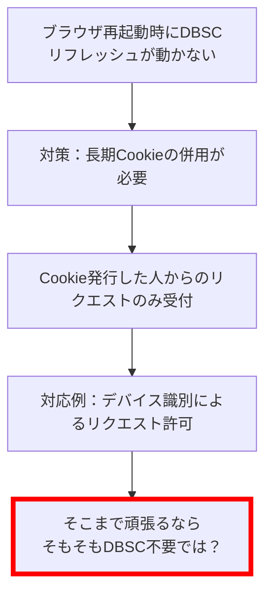

## はじめに
以前の記事でDevice Boudn Session Credentials(以降DBSC)を試していました。
別タブでもCookieが有効期限切れになっても動くね、すごいねと書きました。
一方で、ブラウザの再起動では再度アクセスしても動かないから、DBSCを適用するアプリは限定されるかもと書いています。
その後、一般的なアプリではどういうアプローチでDBSCを選択するのかが気になり、以下のイシューを作成しました。
https://github.com/w3c/webappsec-dbsc/issues/192
このイシューでやり取りする中で、ブラウザの再起動時はDBSCが使用できないのは勘違いだと分かりました。
自分の誤解であまりにもDBSCを過小評価していました。
Web標準として仕様策定が勧められているDBSCが、ブラウザの再起動を考慮していなはずがありませんでした。
本当に申し訳ない気持ちと、DBSCってやっぱり凄い、今後のセッション管理におけるデファクトスタンダードになっていきそうという感動しています。
今回は現状ブラウザの再起動でもDBSCによるリフレッシュ処理が動くための設定と、そこに至った流れを書いていきます。
## 先にブラウザの再起動時にもDBSCを動かす設定を共有
この後の話は正直長ったらしいが中身の無い話なので、先にブラウザの再起動時にもDBSCが動く設定を記載します。
ブラウザの再起動時も動くには、`chrome://flags/` にて「Device Bound Session Credentials (Standard) Persistence」をenableにする必要があります。
なので、以下の形でフラグを有効にすれば同一タブ～ブラウザの再起動時までDBSCが動きます。

では、とりとめのない話をしていきます。
## ブラウザの再起動時は動かないどうしたもんか
DBSCを実装して、異なるタブでも上手く動くから感動していました。
ただ、ブラウザ再起動時にはリフレッシュ処理が走らず、当初はDBSCの使い方を考える必要性を感じていました。
一応、DBSCはログイン～DBSCの開始までの間、もしくはDBSCが失敗したタイミング用に有効期限の長いCookieを持たせることが[言及されています](https://developer.chrome.com/docs/web-platform/device-bound-session-credentials?hl=ja)。
となれば、ブラウザの再起動時にはそのCookieで認証しているかをチェックし、DBSCを再度開始させる必要があると考えていました。
ただ、この使い方を単純に考えてしまうと、DBSCの利点が無くなります。
DBSCの仕組みによって有効期限の短いCookieを用いてもユーザー体験を損なわないようになっています。
そして、有効期限が短いのでCookieを盗難されても、被害を最小限にできます。
一方、ブラウザの再起動時は有効期限の長いCookieを使うと、結局安全性が有効期限の長いCookieに依存します。
有効期限の長いCookieさえあれば、DBSCを張れるようになってしまうためです。
となると、有効期限の長いCookieを使う場合は、例えば発行したユーザー以外からのリクエストに含まれていたらエラーにするなどが必要かと思います。（リスクベースとかですかね？）
しかし、有効期限の長いCookieに対してそこまで頑張る必要があるなら、そもそもDBSCは必要なのか？という疑問が芽生えてきました。
ここら辺の考えをフローにしたのが以下の通りです。

仕様や他のイシューを見ても、上記の点について言及はしておらずどうしてよいか分からなくなってしました。
そこで、以下のイシューを作成し、方針についてお伺いすることとしました。
https://github.com/w3c/webappsec-dbsc/issues/192
## ブラウザの再起動時にも動くのが正しい動作だよ
作成して数日後、Collaboratorの人から以下の返信がきました。
> DBSC sessions should persist across restarts as well. When the user opens the browser, you are correct that the short-lived cookies have expired. But DBSC will load the key pairs and session database from disk, then do a refresh on first request. This can add latency at startup, but it is otherwise not user-visible.
> 

Cookieが有効期限切れの状態でブラウザの再起動しても、ディスクにある鍵のペアとセッションデータベースを読み込むからDBSCのリフレッシュ処理が実行されるよとのことでした。
この回答を聞いた時は、驚き半分申し訳なさ半分でした。
そもそも私が実装したDBSCの動き自体が正常動作ではなく、再起動するときもDBSCは実行されるのが正常動作というのは驚きでした。
再起動時もDBSCの実行がされるなら、自分の実装が間違えていそうなので、コードを確認するようにしていました。
（ちなみに、以前公開鍵の値についてイシューを作成したのですが、単なる自分の勘違いが原因でした。今回も同じかなと思い、申し訳ない気持ちになっていました）
## Net.DeviceBoundSessions.SessionStoreLoadSuccessはあるのか？
ブラウザの再起動時もDBSCが実行されるとのことで、改めて実装の不備がないかを確認していました。
ただ、仕様と照らし合わせても、リフレッシュ処理が実行される点での不備を見つけることができませんでした。
すると、Collaboratorの人から以下の連絡をいただきました。
> I'm particularly interested in `Net.DeviceBoundSessions.SessionStoreLoadSuccess`, since that's unique to browser restarts. Can you also share which platform you're developing on? Are you testing with or without enabling software keys?

`chrome://histograms`でログを収集できる状態にして、その時にDBSCに関連するログを確認して欲しいとのことでした。
そして、特に`Net.DeviceBoundSessions.SessionStoreLoadSuccess`が存在するかを着目して欲しいとのことでした。
後、DBSCを開発・実行している環境についても教えて欲しいという内容もありました。
`chrome://histograms`の存在を知らないつつも、ログの確認方法を教えてもらったので実際に動かして対応するようにしました。
## Net.DeviceBoundSessions.SessionStoreLoadSuccessはなかった
ログを確認しましたが、`Net.DeviceBoundSessions.SessionStoreLoadSuccess`を見つけることはできませんでした。
代わりに、以下のログは確認できました。
- Net.DeviceBoundSessions.TotalRequestDeferredDuration: 1 sample, mean = 310.0
- Net.DeviceBoundSessions.RequestDeferralCount: 2158 samples, mean = 0.0
- Net.DeviceBoundSessions.RegistrationResult: 1 sample, mean = 0.0
- Net.DeviceBoundSessions.RefreshResult: 1 sample, mean = 0.0

`Net.DeviceBoundSessions.SessionStoreLoadSuccess`がないということから、やはり何かが足りないのだろうとは思いましたが見当はついていません。
何が原因なのか分からないので、その他の開発環境であったりDBSCを使うためのフラグ情報を送りました。
## フラグが足りないよ
これまでは、大体2日おきに返信があったのですが今回は1日で返信がきました。
その内容が以下の通りです。
> Oh no I forgot to ask the basic question: did you enable the flag #enable-standard-device-bound-session-persistence? That's the one that turns on persistence across browser restarts.

`chrome://flags/`で「Device Bound Session Credentials (Standard) Persistence」のフラグを有効にしてる？とのことでした。
公開鍵に関するイシューの時と同様に、申し訳ない気持ちになりました。
実際に`chrome://flags/`で「Device Bound Session Credentials (Standard) Persistence」のフラグを有効にして、以下の状態でDBSCを動かしました。

すると、再起動時もリフレッシュ処理が実行され、Cookieが更新されました。
動いた当初は感動しました。
当初私が考えていた長期間Cookieの扱いの考慮なんてものは必要なく、DBSCはブラウザの再起動時もCookieを更新してくれます。
なので、アプリ側は如何にDBSCを開始させるかだけを考え、その後は多くを意識する必要はなさそうです。
この動きを見た時に、私の中で将来的なセッション管理のデファクトスタンダードになっていくという気持ちがより強くなりました。
上記の感動はありつつも、[Wiki](https://github.com/w3c/webappsec-dbsc/wiki/Testing-early-versions-of-DBSC)にも書いてあるフラグを有効にせずイシューを作成してしまった申し訳なさもあったので、謝罪をしました。
相手は特に問題ないよと、優しい返信をしてくれました。
大変ありがたかったです…。
そして、最後には以下の言葉をいただきました。
> I really should merge those flags someday.

将来的には、こういったフラグが無くても動くようにしてもらえそうなので、楽しみに待ちたいです。
## （余談）ゲストモードとプライベートウィンドウではリフレッシュ処理は走らない
むしろ当たり前というか、走る方が良くないとは思いますが、ゲストモードとプライベートウィンドウでは通常のブラウザとは同じ動きをしませんでした。
仮に、ゲストモードなどでもリフレッシュ処理が実行されてしまうと、パソコンを共有しているとアプリにログインできてしまいます。
なので、アプリ側は上記のケースに備えてプライベートウィンドウなどではリフレッシュ処理を走らせないか否かを考えないといけないです。
そんなことまで考えるのはしんどいので、むしろリフレッシュ処理は走らなくて安心しました。
## 終わりに
DBSC最高！