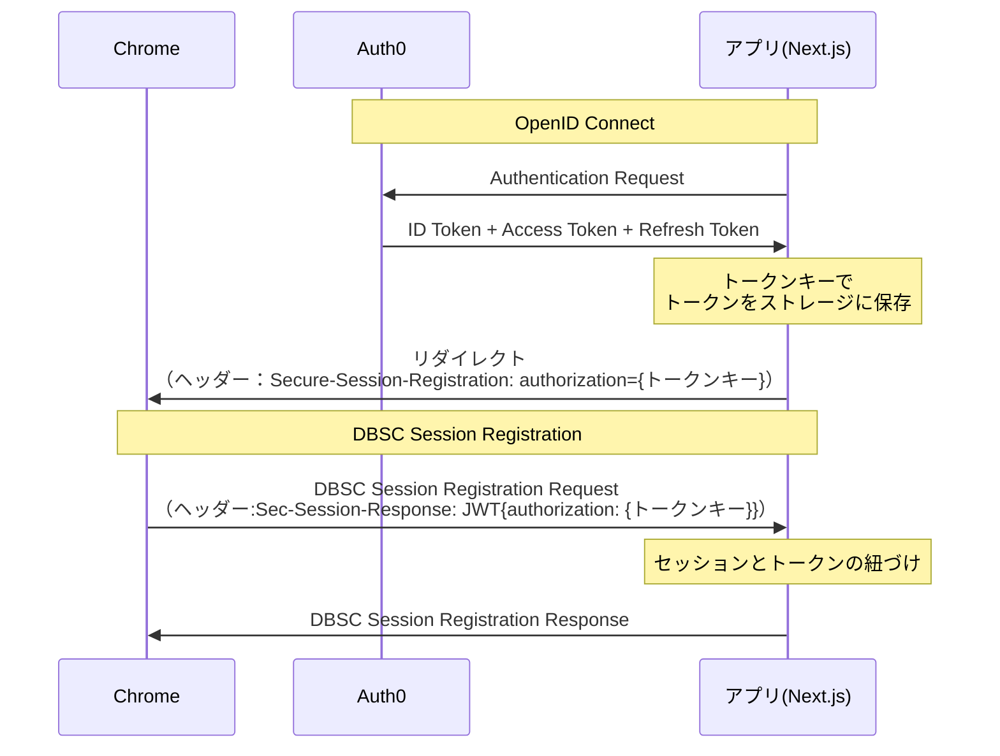

## はじめに
Device Bound Session Credentials(DBSC)のプレビュー版が提供されましたね。
https://workspace.google.com/blog/identity-and-security/defending-against-account-takeovers-top-threats-passkeys-and-dbsc?hl=en
今後DBSCはますます推進されていきそうな予感がします👏
今回はDBSCの中でオプショナルな設定ではありますが、authorizationについて触ってみたのでその感想です。
正直私の中で使いどころが定まっていないですが、とりあえず触ってみたので共有します。
なお、記事や実装で使用しているDBSCの単語と、仕様書の記載に差異があるかもしれません。
例えば、実装ではDBSC関連のヘッダーが「Sec-」で始まっているのに対して、仕様書は「Secure-」で始まっています。
このようなずれは、単純に私の記載ミスはあるかもしれませんが、仕様書の記載とChromeとの挙動が合っていないことが要因です。
そのため、将来的には仕様書の記載に全て統合されると思いますが、現状（2025/07/31時点）では命名やレスポンスステータスなど仕様書とずれがある点はご容赦ください。
## DBSCのauthorizationについて
実装へ入る前に、authorizationについて説明します。
authorizationはDBSCにおいて、DBSCの開始の合図となる[Secure-Session-Registration](https://w3c.github.io/webappsec-dbsc/#secure-session-registration-header)ヘッダーに含まれる値となります。


[Secure-Session-Registration](https://w3c.github.io/webappsec-dbsc/#secure-session-registration-header)ヘッダーに値が存在すると、[Secure-Session-Response](https://w3c.github.io/webappsec-dbsc/#secure-session-response-header)ヘッダーに存在するJWTのpayloadのauthorizationに設定した値が以下のように付与されます。
```json
// Header
{
  "alg": "Signature Algorithm",
  "typ": "dbsc+jwt",
}
// Payload
{
  "aud": "URL of this request",
  "jti": "challenge_value",
  "iat": "timestamp", // Number, represent number of seconds since Jan 1, 1970
  "key": "public key JWK",
  "authorization": "<authorization_value>", // optional, only if set in registration header
}
```
また、[Secure-Session-Response](https://w3c.github.io/webappsec-dbsc/#secure-session-response-header)ヘッダーを含んだリクエストのAuthorizationヘッダーにも[設定した値が付与されます](https://w3c.github.io/webappsec-dbsc/#header-secure-session-response:~:text=If%20authorization%20is%20non%2Dnull%2C%20append%20the%20header%20(%22Authorization%22%2C%20authorization)%20to%20request%E2%80%99s%20header%20list.)。(※2025/07/31時点ではChromeで動かした時、Authorizationヘッダーには値が設定されませんでした)
ちなみに、このauthorizationですが[Secure-Session-Registration](https://w3c.github.io/webappsec-dbsc/#secure-session-registration-header)ヘッダーを返した後実行されるDBSCの登録エンドポイントでしか取得できません。
そのため、更新時は使えない値となる点はご留意ください。
以上がauthorizationが使用される場面についてだったので、authorizationの役割などについても見ていきます。
役割は[README](https://github.com/w3c/webappsec-dbsc#:~:text=The%20authorization%20value,in%20OAuth%202.0.)に以下の記載がありました。
> The authorization value is optional for servers to send, but mandatory for clients to implement. If present, it will be sent to the registration endpoint in the `Authorization` header, and included in the registration JWT. This allows passing a bearer token that allows the server to link registration with some preceding sign in flow, as an alternative to the more traditional use of cookies. While this can also facilitate integration with some existing infrastructure, e.g. ones based on OAuth 2.0, this parameter is general and is not limited to the similarly named [Authorization Code](https://datatracker.ietf.org/doc/html/rfc6749#section-1.3.1) in OAuth 2.0.

DBSCを設定する前に進行している認証フローとDBSCを統合する際に設定することが目的のようです。
役割や目的、お作法などについての記載は以上で、かなり設定に柔軟性があります。
前の認証フローが限定されていないので、具体的な値については実装者判断になります。
一応ユースケースが書かれていそうな[イシューコメント](https://github.com/w3c/webappsec-dbsc/issues/45#issuecomment-2055132814)はありますが、豊富にはありません。
そのため、概念の理解は難しくない一方で、authorizationをどう使うかは色々と考慮が必要そうです。
簡単にですが、authorizationについて説明したので、実際にアプリを動かせるようにし、実装について軽く触れていきます。
## アプリの流れ
今回設定するアプリの流れは以下の通りです。


まず、Auth0でOpenID Connectを使い、ユーザーを識別します。
その後、各種OpenID Connect関連のトークンを取得するので、トークンを取り出すためのキーを作成し、それをもとにトークンを保存します。
保存したら、DBSCを開始するSecure-Session-Registrationヘッダー（Sec-Session-Registrationヘッダー）内のauthorizationに上記キーを設定し、リダイレクトします。
後はChromeがヘッダーを検知して、Next.js側にあるDBSCの登録エンドポイントを実行します。
登録エンドポイントでは、authorizationの値も受け取れるので、その値をもとに保存したトークンを取り出します。
そして、取り出したトークンとセッションを紐づけるまでがこの記事で記載していることです。
大まかな流れを説明したので、アプリを動かすための準備と実装の一部解説をしていきます。
## Auth0の準備
まずはトークンを発行するIdPであるAuth0を設定します。
ちなみに、今回はサクッと設定できるAuth0を使用していますが、正直何でも良いです。
各々、サクッと構築できるIdPを使用してください。
後、今回Auth0はすでにテナントが作成されていることが前提となっています。
テナントが存在していない方は、例えば以下の記事などで設定を完了しておいてください。
https://qiita.com/zumax/items/9da91f63a07b2d1df3b9#%E5%AE%9F%E8%B7%B5
### ユーザー作成
ログイン画面でログインするユーザーを作成しておきます。
サイドメニューのUser Management→Usersにアクセスします。
その画面の右側にあるCreate Userをクリックし、Create via UIを押します。
すると、ユーザー作成するモーダルが表示されるので、任意のメールアドレスとパスワードを設定します。
### APIの作成
次にAuth0のAPIを作成します。
Auth0のアプリケーション対象となるAudienceが紐づいていないと、発行するトークンのペイロードが空になります。
なので、まずはAPIを作成してアクセストークンを使用するサーバーを設定しておきます。
サイドメニューのApplications→APIsにアクセスします。
すると以下のような画面が表示されます。

画面右にあるCreate APIをクリックすると、以下のようなモーダルが表示されます。

Nameは任意のもので、Identifierはアクセストークンを使用するサーバーのURLを記載してください。
今回私は、Next.jsのAPI用としてアプリケーションを作るので、`http://localhost:3000/api`としています。
JWT Profileは任意のものを選んでください。
JWT Signing Algorithmは公開鍵方式のPS256かRS256であれば、どちらでも良いです。
作成後、APIのSettingsタブの内容が表示されると思うので、その中にある「Acess Settings」までスクロールし、「Allow Offline Access」を有効にします。

この設定がないとリフレッシュトークンを設定することができないためです。
### アプリケーションの作成
APIを作成したら、次にサイドメニューのApplications→Applicationsに移動します。
そこで、画面右にある「Create Application」ボタンをクリックします。
今回は、Next.jsのサーバーサイドでやり取りを行うので「Regular Web Applications」を選択します。


作成後、アプリケーション内のSettingsタブに移動し、Application URIsを以下のように設定します。

ドメインは自分で動かしている環境に設定しておいてください。
画面下部にある、セーブボタンで設定を保存したら、次にAPIsタブに移動します。
そこで、以下のように先ほど作成したAPIをアプリケーションと紐づけます。

これでAuth0の準備は完了です。
## Next.jsを使用したアプリの準備
次に、Next.jsのアプリケーションの準備を行います。
コードが記載されているGitHubは以下にありますので、ご参照ください。
https://github.com/maronnjapan/sample-id-app/tree/dbsc-with-authorization-by-auth0
なお、DBSC周りの処理は以下のリポジトリの実装を流用します。
https://github.com/maronnjapan/sample-id-app/tree/check-session-dbsc
DBSC周りで流用しているのは以下ファイルとなります。
- src/app/api/refresh-dbsc-cookie
- src/app/api/register-dbsc-cookie

それ以外についても、適宜変更しておりますがDBSCと直接は関係ないので割愛します。
また流用したリポジトリに関わる記事は以下にありますので、合わせて参照いただけますと幸いです。
https://zenn.dev/maronn/articles/program-dbsc-app
### DBSCの使用設定
前提として、Chromeで動くことを想定しています。
そのため、[以前書いた記事](https://zenn.dev/maronn/articles/dbsc-when-browser-restart#%E5%85%88%E3%81%AB%E3%83%96%E3%83%A9%E3%82%A6%E3%82%B6%E3%81%AE%E5%86%8D%E8%B5%B7%E5%8B%95%E6%99%82%E3%81%AB%E3%82%82dbsc%E3%82%92%E5%8B%95%E3%81%8B%E3%81%99%E8%A8%AD%E5%AE%9A%E3%82%92%E5%85%B1%E6%9C%89)を参照いただき、DBSCが動く設定にしておいてください。
### Auth0との接続
まず先ほど作成したAuth0との接続を行います。
といっても、クイックスタートの[Install the Auth0 Next.js SDK](https://auth0.com/docs/quickstart/webapp/nextjs/01-login#install-the-auth0-next-js-sdk)以降をやるだけです。
ただし、Auth0Clientを作成するファイル（[auth0.ts](https://github.com/maronnjapan/sample-id-app/blob/dbsc-with-authorization-by-auth0/src/lib/auth0.ts)）については、以下のように実装を変更しています。
```ts
import { InMemoryDB } from "@/storage/in-memory";
import { SdkError } from "@auth0/nextjs-auth0/errors";
import { Auth0Client } from "@auth0/nextjs-auth0/server";
import { OnCallbackContext, SessionData } from "@auth0/nextjs-auth0/types";
import { NextResponse } from "next/server";
import { sortUlid } from "@/util";

export const auth0 = new Auth0Client({
    authorizationParameters: {
        /** scopeの設定は任意です。設定がない場合、デフォルトのスコープがアクセストークンに割り当てられます */
        scope: process.env.AUTH0_SCOPE,
        /** audienceは必須です。これがないと、アクセストークンのペイロードが空になります */
        audience: process.env.AUTH0_AUDIENCE,
    },
    onCallback: async (error: SdkError | null, ctx: OnCallbackContext, session: SessionData | null) => {
        if (error || !session || !session.tokenSet) {
            return NextResponse.json(
                { error: 'Authentication failed' },
                { status: 401, statusText: 'Unauthorized' }
            );
        }

        const challenge = crypto.randomUUID()
        const authorization = crypto.randomUUID()

        /** 後続のフローでSec-Session-Responseのpayloadに含まれるjtiと一致するかを確認するためにchallengeを保存する。 */
        await InMemoryDB.set(challenge, challenge, { ex: 60 * 5 });

        /** 後続のフローで、DBSCのauthorizationからトークンを取得するために保存しておく */
        await InMemoryDB.set(authorization, JSON.stringify(session.tokenSet), { ex: 60 * 5 })

        /**
         * DBSCを開始するための値
         * 最初に署名に使用する鍵のアルゴリズム
         * pathに署名したトークンを渡すエンドポイントの設定
         * トークンを識別するためのchallenge
         * challengeはデバイスで署名したJWTのjtiに使用される
         * https://w3c.github.io/webappsec-dbsc/#header-sec-session-registration
         */
        const secSessionRegistration = `(ES256 RS256);path="/api/register-dbsc-cookie";challenge="${challenge}";authorization="${authorization}"`;

        const cookieKey = sortUlid();
        return NextResponse.redirect(
            new URL(ctx.returnTo + `?cookieKey=${cookieKey}` || "/", process.env.APP_BASE_URL),
            {
                headers: {
                    "Sec-Session-Registration": secSessionRegistration,
                    /** このCookieセットはフロントで表示させるための実装なので、DBSCには何も関係がない。 */
                    "Set-Cookie": `${cookieKey}=${encodeURIComponent(`start DBSC Session  Sec-Session-Registration:${secSessionRegistration}${(new Date()).toISOString()}`)}; Path=/; Domain=localhost; `
                },

            }
        );

    }
});
```
説明は後にしますが、とりあえずonCallbackに設定を追加したんだと認識いただければ幸いです。
また、リフレッシュトークンを取得したいので、環境変数のAUTH0_SCOPEは`openid profile email offline_access`としており、`offline_access`を設定しています。
これをすれば、アプリを起動後`画面に表示されたログインボタンをクリックすれば、Auth0のログイン画面に遷移します。
以上で接続が完了です。
## authorizationを中心にしたDBSC周りの実装解説
ここでは、authorizationを使うために行った実装を中心に見ていきます。
### 各種トークン変更後のリダイレクトにauthorizationを追加
この部分が今回の記事の主要部分です。
ファイルとしては、[src/lib/auth0.ts](https://github.com/maronnjapan/sample-id-app/blob/dbsc-with-authorization-by-auth0/src/lib/auth0.ts)になります。
その中でも、onCallback部分です。
全体像は先ほど展開しているので、ここでは特に着目する点を記載します。
```ts
onCallback: async (error: SdkError | null, ctx: OnCallbackContext, session: SessionData | null) => {
        const challenge = crypto.randomUUID()
        const authorization = crypto.randomUUID()
        
        /** 後続のフローで、DBSCのauthorizationからトークンを取得するために保存しておく */
        await InMemoryDB.set(authorization, JSON.stringify(session.tokenSet), { ex: 60 * 5 })

        const secSessionRegistration = `(ES256 RS256);path="/api/register-dbsc-cookie";challenge="${challenge}";authorization="${authorization}"`;

        const cookieKey = sortUlid();
        return NextResponse.redirect(
            new URL(ctx.returnTo || "/", process.env.APP_BASE_URL),
            {
                headers: {
                    "Sec-Session-Registration": secSessionRegistration,
                },

            }
        );

    }
```
以前と異なるのは、`Sec-Session-Registration`に設定している値にauthorizationを追加しています。（変数secSessionRegistration）
これによって、DBSCの登録エンドポイントを実行する時に、authorizationに設定した値が[Secure-Session-Registration](https://w3c.github.io/webappsec-dbsc/#secure-session-registration-header)ヘッダー(Sec-Session-Registrationヘッダー)のJWTに付与されます。
そして、DBSCの登録エンドポイントでセッションとAuth0発行のトークンを紐づけるために、`InMemoryDB.set`でauthorizationの値をキーにしてストレージにトークンを保存しておきます。
最後に、Auth0提供のライブラリの仕様上、認可コードをもとにトークンを取得した後のリダイレクト先を設定する必要があります。
なので、リダイレクトするレスポンスヘッダーに`"Sec-Session-Registration": secSessionRegistration`を設定し、DBSCのフローが開始するようにします。
### authorizationの取得と、トークンへの紐づけ
authorizationは登録エンドポイント実行時に、取得できるものでした。
そして、先ほどDBSCを開始する`Sec-Session-Registration`ヘッダーでDBSCを開始させる前に、トークンをストレージに保存していました。
そのため、まだ各種トークンとセッションの紐づけができていません。
なので、DBSCの登録エンドポイントである[src/app/api/register-dbsc-cookie/route.ts](https://github.com/maronnjapan/sample-id-app/blob/dbsc-with-authorization-by-auth0/src/app/api/register-dbsc-cookie/route.ts)に改修を加えます。
コード全体は上記route.tsを見てもらうとして、追加した部分は以下の通りです。
```ts
    const authorization = payloadJson.authorization;
    const authorizationValue = await InMemoryDB.get(authorization)
    if (!authorization || !authorizationValue) {
        return NextResponse.json(JSON.stringify({ message: 'No ID token' }), {
            status: 401,
            statusText: 'Unauthorized',
        })
    }

    const authorizationObj = JSON.parse(JSON.stringify(authorizationValue)) as SessionData['tokenSet']
    await InMemoryDB.set(sessionId, JSON.stringify(
        { accessToken: authorizationObj.accessToken, refreshToken: authorizationObj.refreshToken }
    ), { ex: 60 * 60 * 24 * 30 });
    await InMemoryDB.del(authorization)
```
[Secure-Session-Registration](https://w3c.github.io/webappsec-dbsc/#secure-session-registration-header)ヘッダー(Sec-Session-Registrationヘッダー)のJWTに付与された署名の検証が終わった後に、JWTのpayloadに存在しているauthorizationプロパティを取得します。
そして、authorizationの値から保存していたトークンを取得します。
トークンを取得したら、DBSCのセッションIDとトークンを紐づけ、もともと保存していたものを削除します。
これで、DBSCのセッションとアクセストークン周りを紐づけることができました。
後はDBSCで設定したCookieからトークンを取得し、適宜必要なAPIにアクセストークンを付与すれば権限などの管理ができます。
そして、今回は行っていませんがDBSCの更新のタイミングでアクセストークンの有効期限チェックも行い、有効期限が切れていたらリフレッシュトークンを使ってトークンの交換も行えます。
なので、バックグラウンド的にトークンのリフレッシュも行うことができます。
## 試した感想
最後にauthorizationを試した感想を記載します。
特に思ったのは、柔軟性が高くいまいち使い道を定めることが出来ませんでした。
authorizationは位置付けとして、先行している認証フローとの連携を行うためでした。
そのため、あらゆる認証方式が対象となり、authorizationには様々な値を設定できる認識です。
そうなった時に、今回OpenID Connectとの接続をどのように行うべきなのかかなり悩みました。
最初は、DBSCの登録エンドポイントを実行する時に、OpenID Connectで認証できたことを示すためにIDトークンを設定しようと思いました。
ですが、IDトークンを設定してしまうと、実際に使用するアクセストークンやリフレッシュトークンをDBSCのセッションと紐づけることができませんでした。
なので、IDトークン・アクセストークン・リフレッシュトークン全てを結合したものをauthorizationに渡すようにしてみました。
これによって、DBSCの登録エンドポイントで各種トークンを受け取ることはできました。
しかし、`Sec-Session-Registration`ヘッダーは一度ブラウザに到達するので、ブラウザからトークンを確認できるようになります。
せっかくサーバー側でトークン取得処理が完了しているので、DBSCのエンドポイントに値を渡すためにトークンをブラウザ側に渡すのは微妙に感じました。
そのため、今回はトークンをストレージに保存する際に使用したキーをDBSCのauthorizationにセットすることで、DBSCとOpenID Connectのトークンを連携するようにしました。
以上のように、authorizationは結構自由にできる分、結構悩むポイントが多い気がします。
特に、authorizationに何を渡すかはアプリの構成などを踏まえる必要があり、想定より難しい印象です。
後、正直思ったのですが、今回のケースだとauthorizationは不要な気もします。
以下Googleの記事にもあるように、DBSCが失敗してもアプリを使用可能とするために、フォールバック用のCookieを設定することがあると思います。
https://developer.chrome.com/docs/web-platform/device-bound-session-credentials?hl=ja#caveats_and_fallback_behavior
であれば、このフォールバック用のCookieをキーにしてトークンをストレージに保存すれば今回行った実装と同じことができます。
一応authorizationを使えば、署名している値から取得できるので改ざんされていない可能性は上がります。
ですが、フォールバック用のCookieを使った方が、全体的なユーザー体験は良くなるきがしています。
このように、正直authorizationはどう活用すれば良いか結論をだすことが出来なかったので、詳しい方がいらっしゃいましたらコメントいただけますと幸いです。
## おわりに
今回はDBSCにおけるauthorizationについて見ていきました。
存在する意図としては理解できるのですが、では実際にどう使っていくかについてはまだ見えていません。
今後DBSCが当たり前になったら、活用事例とかも出てくると思うので、それを待とうと思います。
本当はイシューとかで聞いてみたいのですが、質問内容が思い浮かばなかったためできていません。
後、DBSCのコア部分でもないから聞くのが申し訳ないという気持ちもあります。
こんな感じで、authorizationについてあまりちゃんと説明できておらず申し訳ないです。
とはいえ、authorizationを実際に動かすことはこの記事を読んでいただければできると思うので、良ければ読んだ感想やご指摘などいただければ幸いです。
ここまで読んでいただきありがとうございました。


	