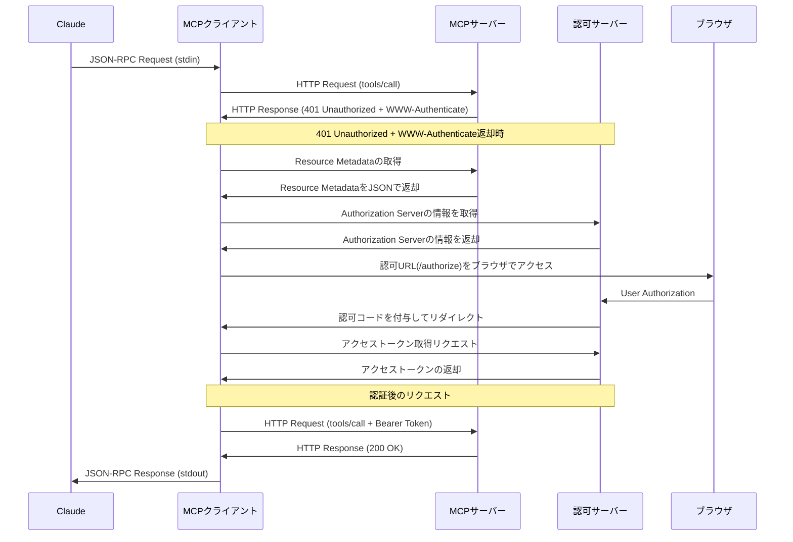

## はじめに
昨今の生成AIの進歩は凄まじいものがあります。
そして、それを推進した要因の一つに[MCP](https://modelcontextprotocol.io/introduction)があります。
今回はこのMCPにおいて、認可機能をドキュメントを見て、実装してみます。
完璧なものが提供はできていないかもしれないですが、この記事でMCPのAuthorizationがどんなものかの概要が実装レベルでつかめるようになれば幸いです。
少し長いですが、良ければお付き合いください。
## MCPドキュメントの概要を掴む
まずはMCPが提供している[Authorizationのドキュメント](https://modelcontextprotocol.io/specification/2025-06-18/basic/authorization)を読んで簡単な概要と感想を記載します。
なお、今回読んでいるのは2025-6-18に発行されたものです。
### 1.1 Purpose and Scope
HTTP通信を基準としているみたいです。
その他の基準は一般的なOAuthとしての役割を書いている感じです。
### 1.2 Protocol Requirements
MCPで認可フローを構築する時の注意点の記載です。
以下の3パターンについて言及しています。
- HTTP通信なら、このドキュメントを準拠すること
- STDIO通信ならこのドキュメントに準拠しないこと
- それ以外の通信なら、その通信のベストプラクティスに従うこと

MCPのAuthorizationについては、基本的にHTTP通信に焦点をあてていそうですね。
### 1.3 **Standards Compliance**
認可機能を搭載する際の準拠するRFCを展開しています。
具体的には以下の形です。
- OAuth 2.1 IETF DRAFT ([draft-ietf-oauth-v2-1-12](https://datatracker.ietf.org/doc/html/draft-ietf-oauth-v2-1-12))
- OAuth 2.0 Authorization Server Metadata ([RFC8414](https://datatracker.ietf.org/doc/html/rfc8414))
- OAuth 2.0 Dynamic Client Registration Protocol ([RFC7591](https://datatracker.ietf.org/doc/html/rfc7591))
- OAuth 2.0 Protected Resource Metadata ([RFC9728](https://datatracker.ietf.org/doc/html/rfc9728))

ただし、動的クライアント登録機能(Dynamic Client Registration Protocol )任意みたいです。
MCPを公開するとかが無ければ、動的クライアントはあまり搭載する動機はないかと思います。
それ以外に関しては、基本的に搭載すべきだと思います。
よっぽど特殊な事情（納期が相当短い等々）があればMetadata周りの搭載は省いても動くかと思いますが、汎用性は消えるので基本的にはやるべきだと感じています。
### 2. Authorization Flow
OAuth2のAuthorization Codeフローを基準にした説明です。
[ドキュメント](https://modelcontextprotocol.io/specification/2025-06-18/basic/authorization#authorization-flow-steps)にあった以下のフローが全てです。

上記に関しては、動的クライアント登録とかAuthorization Code フローの詳細もあるので大枠を掴む場合は「[2.3.3 Sequence Diagram](https://modelcontextprotocol.io/specification/2025-06-18/basic/authorization#sequence-diagram)」の方が良さそうです。

上記フローは大きく分けて
- 認可サーバーのMetadataを取得する
- 上記Metadataの値を元にAuthorization Codeフローを行う

の二つでまとめられるのかなと思います。
詳細については、基本的に各フローで関わるRFCに準拠しているので、詳細が気になる方はRFCを参考にすると良さそうです。
なお、この節で1.3 Standards Complianceで記載していたRFCに加えてresourceパラメータ([RFC 8707](https://www.rfc-editor.org/rfc/rfc8707.html))の搭載を必須にしています。
仮に認可サーバーがresourceパラメータの機能を搭載していなくても、必ず設定が必要みたいです。
resourceパラメータが必要な理由は見つけることができませんでしたが、デフォルトで返ってくるトークンに含まれるaudienceでリクエストをしてしまうとMCPクライアントが想定していなサーバーも実行できる可能性があります。
なので、resourceパラメータを指定し、MCPクライアントに対応するMCPサーバーだけを対象としたトークンを作成するのは自然だなと感じました。
### 3. Security Considerations
認可機能に関するセキュリティ的な考慮事項について記載されていました。
いろいろと書いてくれてはいますが、内容の元となっているOAuth2.1を読み込んだ方が良いと思います。
そちらはこのドキュメント以外にも注意する点が書かれていますので、下手にここで書くよりOAuth2.1を案内する方が適切かと思いました。（決して面倒だったとかそういうことではないですよ）
### 以前のバージョンから気になった箇所
2025年の6月18日にドキュメントの更新が行われました。
前は2025年の3月26日だったのですが、そのバージョンとの差異で気になった部分を軽く触れます。
それは、MCPサーバーをOAuth2.1の文脈で、リソースサーバーに位置すると定義したことかなと思います。
前のバージョンでは、MCPサーバーは必ずしもリソースサーバーに限定されてはおらず、MCPサーバー自体が認可サーバーとして振る舞うことを許容できる書き方になっていました。
しかし、この度MCPサーバーが認可サーバーとして振る舞うことは想定しなくなりました。
それ故に、以前は記載がなかったOAuth 2.0 Protected Resource Metadata ([RFC9728](https://datatracker.ietf.org/doc/html/rfc9728))が追加される運びとなりました。
この変更は個人的には、流石だと感じています。
認可サーバーの役割を切り離すことで、MCPサーバーとしてあるべき姿の輪郭を定めたことで、MCPサーバーを実装する負担を軽減させたと思います。
認可サーバーの機能をもつと、考えることが相当多くなってしんどいですからね。
以上のように、MCPサーバーを明確にリソースサーバーとして捉えたという点が、前のバージョンとの差異かなと思います。
ここまで、ドキュメントの内容について軽く触れてみましたので、この後は実際に簡単なMCPクライアント・サーバーを構築してAuthorization Codeフローを回してみようと思います。
なお、MCPの概要やMCPクライアント・サーバーの実装の詳細には触れません。
あくまで、Authorization Codeフローに着目して解説を行います。
## 実際にAuthorization Codeフローを構築する
ここでは実際にOAuth2のAuthorization CodeフローをMCPと共に構築しています。
ちなみに作成したMCPサーバーは四則演算の計算結果を返すという簡単な機能です。
### シークエンス図
機能のシークエンスは以下の通りです。

フロー自体は、MCPのドキュメントと大きくはずれていないと思うので、良いとして気になるのはMCPクライアントの存在かもしれません。
ClaudeとMCPクライアントそれぞれ存在していますが、ClaudeがMCPクライアントの役割では？と思われた方がいると思います。
それは適切な指摘です。
本来であれば、別途MCPクライアントを用意するのは不要かと思います。
ですが、今回CluadeをMCPクライアントとしたときに、Metadataの取得からAuthorization Code フローの構築までを行うことができませんでした。
そのため、プロキシ的な役割として一個MCPクライアントを構築し、そことMCPサーバーでAuthorization Codeフローを行うようにしました。
ここについては、他の方法やそもそもClaude自体でもAuthorization Codeフローを行う術をご存知でしたら教えてほしいです。
そして、認可サーバーですが今回はAuth0を使用しています。
認可サーバーの機能を持っていれば何でもいいのですが、別途構築の手間が少ないAuth0で行うと楽だったのでAuth0にしています。
### 実装の前の準備
これから実装を軽く見て、動作確認をしますがその前に以下は前提とします。
- Node.jsが使用できること
- Auth0のダッシュボードにて、Applications→Applicationsで「Regular Web Application」のアプリケーションが存在していること（名前は何でもいいです）
    - 作成したアプリのClient IDとClient Secretはこの後展開するリポジトリの.envに記載してください。
    
    
    
- Auth0のダッシュボードでApplications-APIsにて以下のようにリソースサーバーのURLがAudienceとなっているAPIを作成していること（こちらも名前は何でも良いです）
    
    
    
- 上二つで作成したアプリとAPIを紐づけておくこと
    
    
    
- Auth0のダッシュボードで、User Management→Usersにて任意のユーザーを作成しておくこと

これで下準備は完了です。
やっぱりAuth0は楽ですね。
それでは実際に実装をみていきます。
なお、本来であればOAuth 2.0 Authorization Server Metadata ([RFC8414](https://datatracker.ietf.org/doc/html/rfc8414))とOAuth 2.0 Protected Resource Metadata ([RFC9728](https://datatracker.ietf.org/doc/html/rfc9728))をきちんと実装すべきです。
ですが、今回は動くことを優先したため、Metadata周りについてちゃんと実装できていないです。
また、MCPクライアントやMCPサーバーとして動くために必要な処理についても、ほぼ言及しません。
下手に素人の私が書いてしまうと誤りを含んでしまうためです。
MCPの通信については、すでに日本語含めて有益な情報が一杯あると思うので、別途そちらを参照してください。
そして、その情報を元に私の実装が誤っていた場合は、ご指摘いただけると幸いです。
以上ご認識のほどよろしくお願いいたします。
### 実装について
まずはリポジトリを展開しておきます。
https://github.com/maronnjapan/sample-id-app/tree/mcp-authorization
全体は上記リポジトリに書いていますので、ここでは主要部分をかいつまんで解説します。
まずはMCPクライアント周りについて確認します。
MCPクライアントにおいて、主要なファイルはmcp-client.tsでその中でも特に、handleMCPRequestメソッドが今回の肝です。
全体像は[GitHubのコード](https://github.com/maronnjapan/sample-id-app/blob/mcp-authorization/src/client/mcp-client.ts#L144C3-L257C4)を見てもらうとして、ここでは処理の中身を分割してみていきます。
まずは、最初の処理についてです。
```tsx
/** アクセストークンの取得: パラメータかメモリキャッシュから */
const cachedAccessToken = memoryStorage.getAccessToken();
/** MCPサーバーにHTTPリクエストを送信（アクセストークンがある場合はBearerトークンで認証） */
const response = await this.httpClient.makeRequest(
  request.method,
  request.params,
  cachedAccessToken
    ? { Authorization: `Bearer ${cachedAccessToken}` }
    : undefined
);
```
今回取得したアクセストークンはインメモリに保存しています。
なので、すでにアクセストークンがあればそれを使用してMCPサーバーへリクエストするようにしています。
続いて、Authorization Codeフローを始めるための処理についてです。
```tsx
    /** OAuth2リソースサーバーからのWWW-Authenticateヘッダーを取得 */
    const wwwAuthenticateHeader = response.headers.get('www-authenticate');
    /** 401 Unauthorized でWWW-Authenticateヘッダーがある場合はOAuth2認可フローを開始 */
    if (!response.ok && response.status === 401 && wwwAuthenticateHeader) {
      /** 省略 */
    }
```
MCPサーバーへからのレスポンスにWWW-Authenticateヘッダーがないかを確認し、それが存在してかつ401エラーかをチェックしています。
MCPサーバーのレスポンスステータスが401でかつ、WWW-Authenticateヘッダーに値が存在していればAuthorization Codeフローを始める合図となります。
そのため、条件を満たす時は内部でAuthorzation Codeフローに必要な処理を実行します。
中身を見ていきます。
まずは、認可サーバーの情報を取得するための処理です。
```tsx
/** WWW-AuthenticateヘッダーからリソースメタデータのURLを正規表現で抽出 */
const resourceMetadata = wwwAuthenticateHeader.match(/Bearer\s+resource_metadata="([^"]+)"/);
if (resourceMetadata) {
  const resourceMetadataUrl = resourceMetadata[1];
  /** リソースメタデータのURLから、JSONを取得する */
  const metadataResponse = await fetch(resourceMetadataUrl);
  if (!metadataResponse.ok) {
    throw new Error(`Failed to fetch resource metadata: ${metadataResponse.statusText}`);
  }
  const metadataJson: any = await metadataResponse.json();
  /** 
   * リソースメタデータから認可サーバーのURLを取得
   * 本来であれば複数の認可サーバーがある可能性があり、どれを使用するかの処理が必要だが
   * ここでは最初のものを使用する
   */
  const authorizationServerUrl = metadataJson.authorization_servers[0];
  if (!authorizationServerUrl) {
    throw new Error('No authorization servers found in resource metadata');
  }
  /** 認可サーバーの設定情報を取得 */
  const authServerConfigUrl = `${authorizationServerUrl}/.well-known/oauth-authorization-server`;
  const authServerConfigResponse = await fetch(authServerConfigUrl);
  if (!authServerConfigResponse.ok) {
    throw new Error(`Failed to fetch auth server config: ${authServerConfigResponse.statusText}`);
  }
  const authServerConfig: any = await authServerConfigResponse.json();
  /** 認可サーバーの設定から認可エンドポイントURLを取得 */
	const authUrl = new URL(authServerConfig.authorization_endpoint);
	
	/** ...省略 */
}
```
最初に、リソースサーバーからMetadataを取得しています。
その中のauthorization_serversプロパティには、認可サーバーのURLが存在します。
認可サーバーのURLを元に、認可サーバーの各種Metadata情報がまとまっているURLにリクエスト行い、Authorization Codeフローに必要なURLを取得します。
URLが取得できたら、各種URLへアクセスする際に必要なパラメータを付与します。
```tsx
/** Step 2: Authorization Code フローのためのパラメータを準備 */
const clientId = process.env.CLIENT_ID || "";
/** 認可コードを処理するために用意しているMCPクライアントのURLをリダイレクト先に指定 */
const redirectUri = "http://localhost:8000/verify";
const scope = "openid profile";
const state = Math.random().toString(36).substring(2, 15);
/** stateパラメータをメモリに保存 */
memoryStorage.storeState(state);
/** PKCE (Proof Key for Code Exchange) パラメータを生成・保存 */
const { codeChallenge } = memoryStorage.generateAndStorePKCE();
/** Step 3: 認可URLを構築 */
authUrl.searchParams.set("response_type", "code");
authUrl.searchParams.set("client_id", clientId);
authUrl.searchParams.set("redirect_uri", redirectUri);
authUrl.searchParams.set("scope", scope);
authUrl.searchParams.set("state", state);
authUrl.searchParams.set("resource", "http://localhost:3000");
/**
 * Auth0の仕様に合わせてaudienceパラメータを設定
 * これを設定しないと、Auth0から返ってくるアクセストークンのpayloadが空になる
 * なので、標準仕様ではないはずだが必ず設定する必要がある
 */
authUrl.searchParams.set("audience", "http://localhost:3000");
/** PKCE パラメータを追加 */
authUrl.searchParams.set("code_challenge", codeChallenge);
authUrl.searchParams.set("code_challenge_method", "S256");
/** Step 4: ブラウザで認可画面を開く */
await this.openBrowserAndConfirm(authUrl.toString());
```
各種パラメータについては基本的に[OAuth2.1](https://oauth.net/2.1/)を参照していただければと思います。
パラメータを付与して、URLが作成できたら別途ブラウザを開くようにして、そこで実際に認可サーバーへアクセスして認証を行います。※
※ここで突然認証が出てきますが、実は今回の実装ではOAuthではなくOpenID Connectにてトークンを取得しています。
そのため、ここでAuth0にアクセスするとログイン画面が出てきます。
処理を続けるには認証が必要なので、先程認証を行うと記載しました。
ドキュメントを忠実に再現するのであれば、Auth0以外のものを使用した方が良かったかもしれないです。
ですが、OpenID ConnectはOAuth2のAuthorization Codeをカバーしているので、今回は許容するようにしました。
もし、この判断が誤りそうであればお手数おかけし申し訳ないのですが、是非ともコメントいただけますと幸いです。
というか、私自身判断しかねている部分なので、コメントをバンバンいただきたいです。
Auth0でのログインが完了すれば、simple-http-server.tsで設定した[画面](https://github.com/maronnjapan/sample-id-app/blob/mcp-authorization/src/client/simple-http-server.ts#L35C1-L186C4)にリダイレクトされ、そこで認可コードからアクセストークン取得・保存し、成功すれば画面が表示されます。
上記アクセストークンを取得する流れは、今回のMCPドキュメントの範囲外でかつ完全にOAuth2のみでの話なので詳細は割愛します。
ブラウザを開いてから、トークンを取得するまでの間は以下の処理が走っています。
```tsx
/** Step 5: アクセストークンが取得されるまで待機 */
const waitForToken = (): Promise<string> => {
  return new Promise((resolve, reject) => {
    const checkToken = () => {
      const token = memoryStorage.getAccessToken();
      if (token) {
        resolve(token);
        return;
      }
      setTimeout(checkToken, 500);
    };
    checkToken();
    // 30秒でタイムアウト
    setTimeout(() => {
      reject(new Error("Timeout waiting for access token"));
    }, 30000);
  });
};

await waitForToken();
```
ブラウザにアクセスして、ログインなどを行っている間次の処理に行ってしまうとアクセストークンが取得できていないため、無限にブラウザが開いてしまいます。
なので、ブラウザを開いてアクセストークンが保存されるまでは、待機するようにしています。
これによって、画面上でアクセストークンを取得するまでできて始めて、後続の処理が実行されます。
後続の処理は、同じhandleMCPRequestメソッドを実行しています。
今度は、アクセストークンが存在する状態なのでMCPサーバーへのリクエストで、トークンに問題がなければ401エラーが返ってくることはありません。
以上が、MCPクライアントにおける主要な実装部分です。
MCPサーバーについても見ていきます。
と言っても、MCPサーバーについては、401エラーを返す部分とメタデータのエンドポイントくらいかなと思います。
その他については、トークンの検証であったり、MCPのやり取りを行うための処理なのでこの記事が注目している部分ではないため、割愛します。
一応各種処理にはコメントを書いているので、気になる方は[mcp-server.ts](https://github.com/maronnjapan/sample-id-app/blob/mcp-authorization/src/server/mcp-server.ts)を確認してください。
401エラーを返す部分の実装は以下の通りです。
```tsx
app.post("/mcp", async (req: Request, res: Response) => {
  /** クライアントからのJSON-RPCリクエストボディ */
  const request = req.body;
  /** リクエストのHTTPヘッダー（Authorizationヘッダー等を含む） */
  const headers = req.headers;
  /**
   * ツール実行メソッドの処理（OAuth2認証必須）
   * 
   * Claude が実際にツールを呼び出す際に使用されるメソッド。
   * このメソッドはアクセストークンの検証が必要であり、
   * 認証に失敗した場合は401 Unauthorizedエラーを返す。
   */
  if (request.method === "tools/call") {
    /** HTTPリクエストからAuthorizationヘッダーを取得 */
    const authHeader = headers['authorization'];
    /** Authorizationヘッダーがないか Bearer スキームでない場合は401エラー */
    if (!authHeader || !authHeader.startsWith('Bearer ')) {
      /** 
       * RFC 6750 (OAuth 2.0 Bearer Token Usage) に準拠した401レスポンス
       * WWW-AuthenticateヘッダーでリソースメタデータのURLを通知
       */
      res.status(401).header({
        "WWW-Authenticate": 'Bearer resource_metadata="http://localhost:3000/.well-known/oauth-protected-resource"'
      }).json({
        jsonrpc: "2.0",
        id: request.id,
        error: { code: -32000, message: "Unauthorized" }
      });
      return;
    }
    /** Authorizationヘッダーから"Bearer "プレフィックスを除去してアクセストークンを抽出 */
    const token = authHeader.replace(/Bearer\s+/, '');
    /** Auth0 JWTアクセストークンの検証実行 */
    try {
      const isValid = await validateToken(token);
      console.log('Token is valid:', isValid);
      /** トークン検証に失敗した場合は401エラーで再認証を促す */
      if (!isValid) {
        res.status(401).header({
          "WWW-Authenticate": 'Bearer resource_metadata="http://localhost:3000/.well-known/oauth-protected-resource"'
        }).json({
          jsonrpc: "2.0",
          id: request.id,
          error: { code: -32000, message: "Invalid token" }
        });
        return;
      }
    } catch (error) {
      /** トークン検証中の例外をキャッチして401エラーで返す */
      console.error('Token validation error:', error);
      res.status(401).header({
        "WWW-Authenticate": 'Bearer resource_metadata="http://localhost:3000/.well-known/oauth-protected-resource"'
      }).json({
        jsonrpc: "2.0",
        id: request.id,
        error: { code: -32000, message: "Token validation failed" }
      });
      return;
    }
   
   /** 省略 */
});
```
Authorization ヘッダーのBearerトークンを取得し、そもそも無ければWWW-AuthenticateヘッダーにリソースサーバーのMetadataが取得できるURLを付与して401を返しています。
また、存在していたとしてもトークンが有効ではなければ、同じく再度アクセストークンを取得させるために同様のレスポンスを設定しています。
Metadaのエンドポイントは以下の実装をしています。
```tsx
app.get('/.well-known/oauth-protected-resource', (req: Request, res: Response) => {
  res.json(
    {
      /** このリソースサーバーのURI */
      "resource":
        "http://localhost:3000",
      /** このリソースを保護する認可サーバーのリスト */
      "authorization_servers":
        ["https://mcp-authorization-server.jp.auth0.com"],
    }
  );
});
```
本当は他にもプロパティがあるのですが、今回は必要最低限にしています。
以上が実装部分です。
それでは動作確認をしていきます。
### 動作確認
動作確認を行うためには以下のことを行いました。
- プロジェクトのビルド(`npm run build`の実行）
- MCPサーバーの起動
- MCPクライアントとClaude Desktopを接続するための設定記載

まずは、MCPサーバーの起動です。
ちゃんとやるなら、MCPサーバーは別途デプロイを行いそれを使う方がよいですが、今回は面倒だったのでローカルで起動させます。
`npm run server`で起動できますので、実行してください。
なお、今回展開しているリポジトリ内のMCPクライアントもMCPサーバーがローカルで起動している前提で書いているので、リモートにアクセスしたい場合は別途コードの書き換えが必要です。
起動できたら、次にClaude Desktopの設定ファイルに接続情報を記載します。
設定ファイルは任意の方法でいいですが、私はいつもClaude Desktop左上のハンバーガーメニューから、「開発者」→「アプリ設定ファイルを開く」で開いています。

JSONファイルが開いたら、mcpServersプロパティの中にnpm run clientスクリプトが実行できるような設定を記載します。
私は今回以下のようにして動かしました。
```json
    "sample-calculator": {
      "command": "wsl",
      "args": [
        "-d",
        "Ubuntu",
        "-e",
        "bash",
        "-c",
        "cd プロジェクトまでのパス && npm run client"
      ]
    }
```
ただ、私はプロジェクトの実装をWSL上、そしてClaude DesktopをWindowsにインストールしているというまあまあ特殊な状況かなと思います。
なので、その他の環境については適宜必要な形でsample-calculatorプロパティの中を書いてください。（他の環境での書き方はあまり分かっていないです。すみません…。）
とにかく、`npm run client`かnodeコマンドでdistディレクトリ配下のclient/index.jsが実行できれば何でもいいです。
その設定が記載できたら、一回Claudeを終了させます。
終了しないと設定が反映されないので、必ず行ってください。
なお、おそらく×ボタンでClaudeを閉じてもダメで、例えばハンバーガーメニューから「ファイル」→「終了」としないと設定が反映されません。
Claudeを終了させ、再度開いた時今回作成したMCPクライアントが使用できるようになっています。
確認方法としては、「検索とツール」をクリックし、以下のようにsample-calculatorが表示されていれば問題ないです。

なお、この時Claudeには以下のようにエラーがでます。

本当は直すべきなのですが、ぱっと解消方法が分からないのと、無視しても動作はするのでスルーしています。
こんな感じでところどころ不備はありますがご容赦ください。
一応ここまでできれば準備完了なので、実際に動かしたものを以下に添付します。
プロンプトは「sample-caluculatorを使って1+2+3を計算して。」を渡しています。

MCPクライアントにアクセスしようとして、Auth0のログイン画面が開きログイン後初めて計算結果が返すようになっていますね。（相変わらず出ているInvalid JSONについてはスルーしてください…）
以上動作確認でした。
## 実装してみての感想
最後に軽く実装した感想を記載します。
### ClaudeをMCPクライアントとしたい
何より思ったのがこれです。
今回プロキシ的な役割でMCPクライアントを設けていますが、正直実装せずに済むならしたくないです。
今回実はOpenID Connectを使っているのですが、受け取ったIDトークンの検証を行っていません。
個人の実装に任せるとこういったセキュリティ面での抜け・漏れを誘発してしまいます。
また、ブラウザを開くとか、アクセストークンが取得できるまで後続の処理を待つとか制御が結構面倒で、ちゃんとするのはもっとハードルが高いと感じています。
なので、Claudeがそういった機能を賄ってくれると嬉しいなと思いました。
### アクセストークンの保存方法について
アクセストークンをどう保存しておくかは今回かなり悩みました。
今回作成したMCPクライアントは基本的にデプロイすることはないと思います。
なので、基本的にはローカルで動く前提で考える必要があります。
そうなると、データベースなどが使えないので例えばKeyChainを使って暗号化した上で、ファイルに書き込むとかになりそうです。
ただ、このやり方がとにかくNode.jsと相性が悪かったです。
Node.jsで動いているアプリから、KeyChainが使えないんですよね。
一応、[keytar](https://www.npmjs.com/package/keytar)というモジュールはあるのですが、現在パブリックアーカイブになっています。
なので、KeyChainを使ってかつ認可サーバーからのリダイレクトに対応するためにはElectronとかでの実装が必要なのかなと思っています。
このようにアクセストークンを書き込んでおいて、アクセストークンが有効な間は認可サーバーにアクセスせずとも済む仕組みを構築するのはかなり壁がありました。
なので、今回はアクセストークンをインメモリに保存して、Claude Desktopが動いている間はそのアクセストークンを使うようにしています。
そのため、PCをシャットダウンして再度Claudeを開いた時や、明示的にClaudeを終了させない限りは何度も認可サーバーにアクセスせずともMCPサーバーが使用できます。
一日に一回は認可サーバーへのアクセスはありますが、数回なら良いかと今回は許容しています。
この辺のUXとセキュリティの兼ね合いを考えるのは中々大変だと実感しました。
## 終わりに
今回はMCPクライアント・サーバー・認可サーバーを用いて、MCPのAuthorizationドキュメントを再現してみました。
ところどころ不備はあるかと思いますが、一旦一通りの流れができたので一安心です。
そして、実装してみて認可サーバーを明確に分けたことでMCPクライアント・MCPサーバーがどこまでやらないといけないかの輪郭が見えてきたと感じています。
まだまだ考慮事項や不足はありますので、もう少し洗練したものを検討できればと思います。
ここまで読んでいただきありがとうございました。