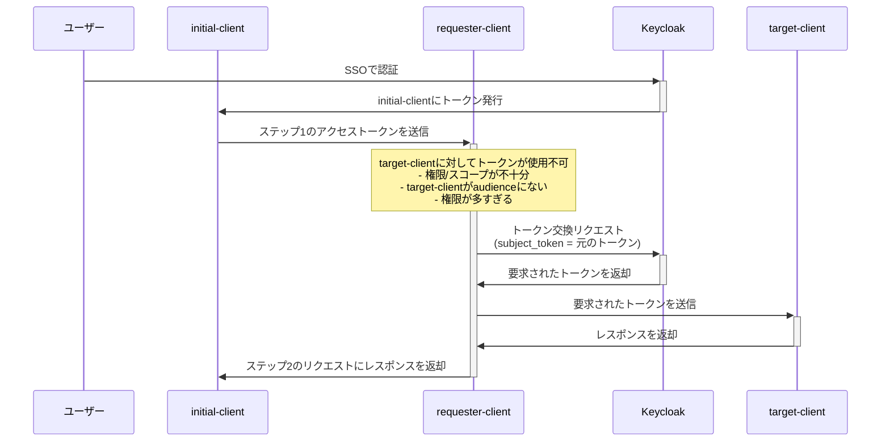

## はじめに
APIを公開したいな、その際に認可の仕組みを導入したいなと思った時の選択肢に挙げられるのが[OAuth2.0](https://openid-foundation-japan.github.io/rfc6749.ja.html)かと思います。
アクセストークンを発行するための、様々な仕様が策定されておりより多くのケースに対応できます。
今回はその中でも、以下のようなケースでトークンの受け渡しを行う時に活用できる仕様についてみていきます
 より引用](/images/token-exchnage-with-keycloak/api-gateway.png)
[Delegation Patterns for OAuth 2.0 using Token Exchange](https://www.scottbrady.io/oauth/delegation-patterns-for-oauth-20) より引用
Gatewayとなる、API1がクライアントから送られてきたアクセストークンを受け取り・検証して、その後その他のAPIを叩くようにしています。
この時、クライアント⇔API1間はクライアントが取得したアクセストークンを検証することで権限管理はできると思います。
一方、API1⇔その他のAPIでもアクセストークンを用いた権限管理がしたいとなった時に、色々と考慮が必要となります。
やり方の一例としては以下のものがあるかと思います。
 より引用](/images/token-exchnage-with-keycloak/poor-mans-delegation.png)
[Delegation Patterns for OAuth 2.0 using Token Exchange](https://www.scottbrady.io/oauth/delegation-patterns-for-oauth-20) より引用
API1で受け取ったアクセストークンをそのまま、API2に渡すという形です。
これ自体も一つの選択肢かと思いますが、例えばAPI3やAPI4がサードパーティーのAPIだったとします。
その時は全て自分たちの環境に閉じることができないので、アクセストークンが漏れてしまったときの考慮も必要になります。
具体的には、アクセストークンが漏れてもAPI3しか実行できないようにするなどです。
その他にも、サードパーティーにAPI2に関する情報を伝えたくないケースもあると思います。
上記のようなことに対応するため、一度受け取ったアクセストークンの情報を絞った状態にして各APIに渡すことが望まれます。
その時に活用できるので、今回触れる[OAuth2 Token Exchange](https://datatracker.ietf.org/doc/html/rfc8693)です。
今回はそのOAuth2 Token ExchangeについてKeycloakを使って実際に体験します。
なお、この後リンクを記載しますがOAuth2 Token Exchangeについての詳細な解説はしません。
すでに、良記事が出ており、追加で解説する必要がないと思ったためです。
なので、この記事は実際に触ってみたということを重視しています。
## OAuth2 Tokne Exchangeについて
### 仕様について
OAuth2 Token Exchangeは一度何かしらのフローで取得したアクセストークン・リフレッシュトークン・IDトークンなどを特定のデータに再度生成し直すための仕様です。
技術の概要について、以下川崎さんの記事を参照ください。
[https://qiita.com/TakahikoKawasaki/items/d9be1b509ade87c337f2](https://qiita.com/TakahikoKawasaki/items/d9be1b509ade87c337f2)
必要な知識は上記に揃っているが、雑にまとめると以下の二点でとなります。
- 権限を追加・削除したトークンに交換
- 別のアカウントの代行者と振舞えるトークンに交換

大分省略している説明なので、正確なことは先程の川崎さんの記事や[RFC](https://www.rfc-editor.org/rfc/rfc8693.html)を見るようにしてください。
とはいえ、権限の追加・絞り込みや他者へのなりすましができるというのが肝かなと思います。
### ユースケースについて
詳しくは以下kokukumaさんの記事を参照してください。
[https://qiita.com/kokukuma/items/34b5aacad9fd9a894730](https://qiita.com/kokukuma/items/34b5aacad9fd9a894730)
ユースケースに関しては、これ以上解説することはないです。
以上がOAuth2 Token Exchangeに関する概要です。
正直概要に関しては紹介した二つの記事が強すぎるので、この記事のオリジナリティを出すために実際に動かして試してみようと思います。
使用するのは、Keycloakです。
理由は無料で使用できて、かつ[Token ExchangeのRFCに準拠](https://www.keycloak.org/2025/05/standard-token-exchange-kc-26-2#:~:text=Compliance%20with%20RFC%208693%20)していそうなのがKeycloakしかなかったためです。
有料なら[Authlete](https://www.authlete.com/ja/)などがあるかと思いますので、実際に導入する時はそちらの検討が第一になるかなと思います。
それでは、Keycloakで実際に確認してみます。
## Keycloak のToken Exchangeについて
実際に動かす前に、KeycloakのToken Exchangeについてみていきます。
OAuth2 Tokne Exchangeは仕様の書き方として、拡張性が高いです。
そのため、実際に機能として提供するシステム側で穴埋めをする必要があります。
KeycloakにもOAuth2 Token Exchangeを搭載する際に、仕様に書かれていない制限などあります。
なので、まずはKeycloak のTokne Exchangeについてみていきます。
なお、ここで言及するのは主にStandard token exchangeであり、以前の機能であるLegacy token exchangeの詳細は触れません。
その点はご留意ください。
### Standard Tokne Exchangeができること
KeycloakのTokne Exchange全体としては以下の[機能](https://www.keycloak.org/securing-apps/token-exchange#:~:text=The%20capabilities%20of,impersonate%20a%20user.)を実行できます。
>1. A client can exchange an existing Keycloak token created for a specific client for a new token targeted to a different client in the same realm.
>2. A client can exchange an existing Keycloak token for an external token, such as a linked Facebook account.
>3. A client can exchange an external token for a Keycloak token.
>4. A client can impersonate a user. 

雑にまとめると以下4つの機能を持ちます。
1. 同じレルム(≒テナント)にある他のクライアント向けのトークンに変更する
2. Keycloakのトークンを外部システム用のトークンに交換する
3. 外部の外部用のトークンをKeycloakのトークンとして交換する。
4. ユーザーのなりすまし

ただし、2025/6/28時点ではStandard Token Exchangeは1のケースしかサポートしていません。
なので、2~4のケースをKeycloakで達成するには、以前から存在するLegacy Token Exchangeにて機能を搭載する必要があります。
Standard Token Exchangeはまだまだ対応しているケースが少ないですが、Keycloakは今後Standard Token Exchangeに機能追加などを行うので、可能な限りStandard Token Exchangeの使用を推奨しています。([参考](https://www.keycloak.org/securing-apps/token-exchange#:~:text=the%20standard%20token%20exchange%20V2%20is%20recommended%20since%20it%20is%20supported%20and%20will%20be%20maintained%20for%20the%20future))
### Standard Token Exchangeの制約
先ほどはできることを確認しました。
ここでは、ドキュメントであったり、実際に動かしてみて分かったStandard Token Exchangeの制約についてもう少し詳しくみていきます。
先ほど「同じレルム(≒テナント)にある他のクライアント向けのトークンに変更する」はできると記載しました。
しかし、上記のケースでも以下のことを確認しました。
- audienceは元のトークンのsubクレームに含まれていないとエラーになる
- audienceとscope両方を設定し、scopeがaudienceで指定したClient Scopeに持っていないと設定したscopeは反映されない。
まず最初の事象について確認します。
[ドキュメント](https://www.keycloak.org/securing-apps/token-exchange#:~:text=The%20subject_token%20sent%20to%20the%20token%20exchange%20endpoint%20must%20have%20the%20requester%20client%20set%20as%20an%20audience%20in%20the%20aud%20claim.)を確認するとaudienceには以下の記載がります。
> The subject_token sent to the token exchange endpoint must have the requester client set as an audience in the aud claim.
> 

トークン内のaudクレームに、audienceに指定したい値が含まれていないとエラーになると記載されています。
そして、それは実際にエラーになることを確認しています。
例えば、元のトークンのaudクレームが`[client1,client2]`を持っているとします。
この時、audienceに`client3`を指定したとしても、エラーになります。
このように、audienceには予めaudクレームに含まれる値しか使用できないようです。
また、audienceとscopeを両方リクエストに含めた場合、受け取るスコープの挙動が変わることを確認しています。
例えば、以下のケースがあります。
- トークンを受け取ったクライアント(client1)
    - scopeは`scope1,scope2`がデフォルトで付与される
    - また、Token Exchangeで`scope=scope3`を指定すると、交換後のトークンではscopeが`scope1,scope2,scope3`となる
- audienceで指定したクライアント(client2)
    - client2はscopeは`scope1,scope2`しか付与しない設定

上記の場合に、audienceには`client2`をscopeには`scope3`を指定すると、client2には`scope3`を持っていないので、交換後のトークンには`scope3`が省かれた形になります。
audienceを変えているのだから、client1のscopeは設定できないのは自然な流れではあるので、この動き自体は正しい挙動だと思います。
ですが、当時の自分はこの正しい挙動を把握できておらず、挙動の解消に時間を要したので共有しました。
audienceを指定した時のscopeについての挙動は[ドキュメント](https://www.keycloak.org/securing-apps/token-exchange#:~:text=The%20audience%20parameter%20can%20be%20used%20to%20filter,be%20used%20for%20%22upscoping%22%20and%20adding%20more%20scopes.)に記載がありますので、展開しておきます。
### トークン交換のフロー
現状Standard Token Exchangeにおいては、トークン交換のケースは以下のようなものが挙げられます。



requester-clientからtarget-clientにアクセストークンを渡す時、元のトークントークンでは不必要な情報が含まれているので、一度アクセストークンを交換してからtarget-clientとやり取りを行っています。
### リクエスト・レスポンス例
Standard Token Exchangeを実際に行うための、リクエスト・レスポンスも確認します。
KeycloakでStandard Token Exchange でトークンを交換する時の基本的なリクエスト例は以下の通りです。
```
POST /realms/レルム名/protocol/openid-connect/token
Authorization: Basic base64(client_id:client_secret)
# クライアントIDとクライアントシークレットを「:」で繋いでBase64エンコードしたものを設定
Content-Type: application/x-www-form-urlencoded
Accept: application/json
grant_type=urn:ietf:params:oauth:grant-type:token-exchange&
subject_token=交換前のトークン&
subject_token_type=urn:ietf:params:oauth:token-type:access_token&
requested_token_type=urn:ietf:params:oauth:token-type:access_token
```
[RFC8693](https://www.rfc-editor.org/rfc/rfc8693.html)に記載はありますが、トークンを交換する場合のエンドポイントはOAuth 2.0におけるトークンリクエストのエンドポイントと全く同じです。
なお、grant_typeはToken Exchangeの場合、お作法的に`urn:ietf:params:oauth:grant-type:token-exchange`とします。([OAuth2のRFC](https://openid-foundation-japan.github.io/rfc6749.ja.html)を確認すると、grant_typeは必須になっているため、OAuth2のトークンを発行するエンドポイント使用するToken Exchangeをgrant_typeを指定しないといけないです。そして、Token Exchangeのリクエストであることを示すために`urn:ietf:params:oauth:grant-type:token-exchange`を指定しています)
`subject_token_type`はsubject_tokenで渡した交換前のトークンの種類を指定しています。
Standard Token Exchangeについては、現状アクセストークンしか想定していないので、`urn:ietf:params:oauth:token-type:access_token`固定になります。
`requested_token_type`はToken Exchangeのレスポンスで返すトークンの種類を指定します。
`requested_token_type`は`subject_token_type`と異なり、アクセストークン以外にもIDトークンやリフレッシュトークンなども指定できます。
ただし、リフレッシュトークンを受け取るには、[追加設定](https://www.keycloak.org/securing-apps/token-exchange#:~:text=Requesting%20a%20refresh,scope%3Doffline_access)が必要です。
が、今回はそこまで検証はしていないです。
このリクエストに、scopeやaudienceを指定すると適切な値であれば、リクエストの値をもとに新しいトークンが発行されます。
処理が成功すれば、以下のレスポンスが返ってきます。
```
{
  "access_token": "eyJhbGciOiJSUzI1NiIsIn...",
  "expires_in": 300,
  "token_type": "Bearer",
  "issued_token_type": "urn:ietf:params:oauth:token-type:access_token",
  "session_state": "287f3c57-32b8-4c0f-8b00-8c7db231d701",
  "scope": "default-scope1",
  "refresh_expires_in": 0,
  "not-before-policy": 0
}
```
Token Exchangeに関わる部分については、[川崎さんの記事](https://qiita.com/TakahikoKawasaki/items/d9be1b509ade87c337f2#%E3%83%AC%E3%82%B9%E3%83%9D%E3%83%B3%E3%82%B9%E3%83%91%E3%83%A9%E3%83%A1%E3%83%BC%E3%82%BF%E3%83%BC)を参照ください。
なお、一個注意点として川崎さんの記事にも記載はありますが、交換後のトークンがアクセストークンであろうとIDトークンであろうと`access_token`プロパティセットされてレスポンスされます。
初見というか、仕様を握していないと絶対に意味不明になる（私はなった）ので、慣習的にIDトークンであろうとアクセストークンであろうと`access_token`プロパティで取得できることは前提として頭に入れておくべきです。
ちなみに、Token Exchangeがエラー時は以下のようなオブジェクトが返ってきます。
```
{
  "error":"invalid_request",
  "error_description":"Invalid token"
}
```
### 標準トークン交換とレガシートークン交換の比較
最後に、Standard Token ExchangeとLegacy Token Exchangeの機能比較を記載します。
2025/6/20で[ドキュメント](https://www.keycloak.org/securing-apps/token-exchange#_standard-token-exchange-comparison)を確認した範囲では以下の通りです。
| 機能 | Standard Token Exchange V2 | Legacy Token Exchange V1 |
| --- | --- | --- |
| 内部間でのトークン交換 | サポート済み。rfc8693に準拠して実装 | プレビューサポート。rfc8693の緩い実装。代わりにV2の使用を推奨 |
| 許可されるsubject_token_type | アクセストークンタイプのみ | 内部-内部の場合はアクセストークンタイプのみ、外部-内部シナリオの場合はJWT |
| 許可されるrequested_token_type | アクセストークン（デフォルト）、リフレッシュトークン、IDトークン | アクセストークン、リフレッシュトークン（デフォルト）、SAML2アサーション |
| scopeパラメータの動作 | 他のグラントと同様。scopeパラメータは、トークン交換リクエストを送信したクライアントのオプショナルスコープをリクエストすることを意味する | audienceパラメータで指定された「ターゲット」クライアントのスコープに基づく。ダウンスコープサポートのみ |
| audienceパラメータの動作 | 仕様に従って複数の値をサポート。利用可能なオーディエンスを絞り込み、リクエストされたオーディエンスのみを保持するために使用可能。必要なターゲットオーディエンスに応じてトークンを効果的にダウンスコープ | 単一のオーディエンス値をサポート。audienceパラメータでリクエストされたクライアントに対して効果的にトークンが発行され、そのクライアントのスコープを使用 |
| パブリッククライアント | 利用不可。V1で実装されたダウンスコープはリフレッシュトークングラントで代替可能 | クライアント自身のトークンを交換する場合のみ利用可能。効果的にダウンスコープサポートのみ |
| 同意 | ユーザーが既に同意を付与している限り、同意が必要なクライアントで許可 | 同意が必要なクライアントでは許可されない |
| 認可 | リクエスタークライアントがsubject_tokenのオーディエンスに含まれている必要があることの検証。クライアントポリシーとの統合。きめ細かい管理権限なし | きめ細かい管理権限バージョン1に基づく |
| 取り消しチェーン | アクセストークンでは利用不可。リフレッシュトークンでは利用可能 | アクセストークンでもリフレッシュトークンでも利用不可 |
| rfc8693による委任 | まだサポートされていない | サポートされていない |
| rfc8693によるリソースパラメータ | まだサポートされていない | サポートされていない |
| フェデレーテッドトークン交換 | まだ実装されていない | プレビューとして実装済み |
| サブジェクト偽装（直接的なsubクレームの偽装を含む） | まだ実装されていない | プレビューとして実装済み |

KeycloakのStandard Token Exchangeについて確認したので、実際に動かしていきます。
なお、サンプルコードは以下に記載していますので、実際に動かしたい方は参考にしていただければ幸いです。
[https://github.com/maronnjapan/sample-id-app/tree/oauth-token-exchange-by-keycloak](https://github.com/maronnjapan/sample-id-app/tree/oauth-token-exchange-by-keycloak)
## Keycloakの設定方法(ローカルのみ)
まずはローカルで試すためのDockerコンテナの準備をします。
Dockerじゃなくても動かせますが、Dockerが楽なのでDockerにしています。
そのため、Dockerが設定されていることが前提となります。
また、コードについては先ほど展開したリンクがありますので、極力省略しています。
### 1. Keycloakサーバーの起動
```bash
# プロジェクトルートディレクトリで実行
docker-compose up -d
```
このコマンドにより以下のサービスが起動します：
- Keycloak: [http://localhost:8080](http://localhost:8080/)
- PostgreSQL: localhost:5432（Keycloak用データベース）
### 2. Keycloakのコンソール設定
コンテナが起動してから、少し時間をおいて
[http://localhost:8080](http://localhost:8080/)
にアクセスすると、以下ログイン画面が表示されます。

ここにdocker-compose.yamlで設定したユーザーID(admin)、パスワード(admin)を入力します。
入力後、サイドメニューから「Manage realms」をクリックし、表示された画面で「create realm」ボタンを押します。

そしたら、適当な名前でRealmを作ります。（今回は`oauth-token-exchange`という名前で作成）
作成後、サイドメニューからClientsを選択し、「Create Client」ボタンをクリックします。

作成画面で、任意のクライアントIDを指定します。（今回は`oauth-token-exchange-client`）
そして、ここが滅茶苦茶重要なのですが、Client AuthenticationをOnにして、Confidential Clientにします。
また、`Standard Token Exchange`を有効にします。

後は、今回KeycloakとアプリのURLが異なるので、リダイレクト先のURLとして`http://localhost:3000/api/auth/callback/keycloak`を設定します。

作成したら、Credentialsタブに移動し、Client Secretの値をコピーします。
もう一個似た流れで、Clientを作成してください。（今回は`oauth-token-exchange-client-part2`という名前で作成）
ただし、Keycloakとやり取りするクライアントと関係しないので、「Valid redirect URIs」の設定は不要です。
クライアントを作成したら、`oauth-token-exchange-client`に再度アクセスし、「Client scopes」タブに行き「oauth-token-exchange-client-dedicated」を選択します。
遷移後、Mappersタブから「Configure a new mapper」をクリックし、モーダルを表示させます。
表示されたモーダルから「Audience」選びます。

任意の名前を記入します。（今回は`token-exchange-client-mapper`を使用）
「Included Client Audience」には先ほど作成した、`oauth-token-exchange-client-part2`を設定し、Mapperを作成します。
次に、サイドメニューからClients Scopesをクリック、「Create client scope」を押します。

名前は任意のものでよいです。（今回は`te-exchange-scope`としました）
ただし必ず「Include in token scope」はOnにする必要があります。
これを設定しないと、Token Exchangeで対象のスコープを設定しても取得できません。

作成後、`oauth-token-exchange-client`クライアントに再度アクセスし、その中にあるClient Scopesタブに移動します。

「Add client scope」をクリックし、出てくるモーダルにて先ほど作成した`te-exchange-scope`にチェックを入れ、Optionalで追加します。

これで、OAuth2 Token Exchangeの設定は完了しました。
後は、ログインをしてトークンを取得するためにユーザーを作成しておきます。
サイドメニューのUsersから、表示画面でユーザー作成ボタンを押し、任意のユーザー名でユーザーを作成します。（今回は`test`という名前にした）
作成後表示される画面で、「Credentials」をクリックしパスワード作成ボタンで任意のパスワードを作成します。（今回は`test`というパスワードにした）
ただし、Temporaryは無効にしました。
これを有効にすると、ログインがパスワードを変更する必要が出るためです。
別にあっても問題はないのですが、検証用のアカウントなので追加操作を減らすために無効としています。
### 3. アプリケーション側の設定
### 3.1 環境変数の設定
プロジェクトルートに `.env.local` ファイルを作成し、以下の環境変数を設定してください：
```bash
# Keycloak設定
KEYCLOAK_CLIENT_ID=oauth-token-exchange-client
# コピーしたシークレットの値を設定
KEYCLOAK_CLIENT_SECRET=ddW4XKYyIJQpdyH01iwJcs2F83lSjJhj
# `http://localhost:8080/realms/作成したレルム名`とする
KEYCLOAK_URL=http://localhost:8080/realms/oauth-token-exchange
# Auth.js設定
# AUTH_SECRETはnpx auth secretで生成したものを使用します <https://cli.authjs.dev>
AUTH_SECRET=your-nextauth-secret
```
### 3.2 依存関係のインストール
```bash
npm install
```
### 3.3 開発サーバーの起動
```bash
npm run dev
```
以上で、Token Exchange機能を持ったアプリケーションが [http://localhost:3000](http://localhost:3000/) で起動します。
### 4. 動作確認のポイント
### 4.1 認証フロー
以下の流れでKeycloakでログインを行ってください。
1. [http://localhost:3000](http://localhost:3000/) にアクセス
2. 「Login」ボタンをクリック
3. Keycloakのログイン画面にリダイレクト
4. 先ほど作成したユーザーIDとパスワードを入力

これを行うと以下のような画面が表示されます。

ちなみにトークンの中身を確認したい場合はコピーボタンがあるので、それでコピーしてもらった後[jwt.io](https://jwt.io/)で確認してください。
### 4.2 Token Exchange機能
次にToken Exchangeの確認方法です。
画面をスクロールすると以下のような画面が表示されると思います。

スコープ、オーディション好きな方を選択し、Token Exchangeを実行してください。
すると、以下のような画面が表示されます。

Scopeを設定した場合は、選択したスコープが存在すること、Audienceを設定した場合は選択したAudienceのみになっていることが確認できるかと思います。
ちなみに両方選んだ時は、スコープは期待動作をしません。
これは、選択したAudienceにte-exchnage-scopeというスコープを設定してないためです。
なので、設定すれば両方選んでも期待動作するはずです。（未検証）
以上で、Kecloakを使ったToken Exchangeの確認ができました。
## Token Exchangeに関わるコードの解説
先ほどKeycloakを使ってToken Exchangeは確認できました。
ここでは、KeycloakのToken Exchangeを使うために設定したアプリケーションのコードの一部を紹介します。
### 1. 認証設定（`src/auth.ts`）
Keycloakとやり取りするための設定はAuth.jsを使っています。
Auth.jsの基本的な設定は[ドキュメント](https://authjs.dev/getting-started/installation)を参照してください。
Auth.js v5を用いてKeycloakプロバイダーを設定し、Token Exchangeに必要なアクセストークンをセッションに保存する仕組みを実装しています。
```tsx
callbacks: {
    session: async ({ session, token, user, newSession, trigger }) => {
        return { ...session, accessToken: token.accessToken }
    },
    jwt({ token, user, account, profile, session, trigger }) {
        if (account?.access_token) {
            token.accessToken = account.access_token
        }
        return token
    },
},
```
ちなみに、Auth.jsはデフォルトではSessionにアクセストークンを保持していません。
なので、トークンを取り出せるようにするために、認証を終えた後取得できるアクセストークンを取り出して、sessionプロパティで使用できるtokenオブジェクトに追加しています。
そして、リクエストの際ミドルウェア的な形で実行する、sessionプロパティのコールバック内でアクセストークンを格納しています。
なお、今回は動作確認の兼ね合い上設定したアクセストークンをフロントで出しているが、今回の構成ではフロントに出さないようにする必要があります。
**重要なポイント：**
- `jwt`コールバック: 初回認証時に`account.access_token`をJWTトークンに保存
- `session`コールバック: JWTトークンからアクセストークンをセッションオブジェクトに移動
### 2. Token Exchange API（`src/app/api/token-exchange/route.ts`）
OAuth2 Token Exchangeを実行するエンドポイントになります。
ここがこのアプリの中で最も大事な処理です。
ここが、実際にKeycloakとOAuth2 Token Exchangeのやり取りを行うためです。
```tsx
import { auth } from "@/auth";
import { NextRequest, NextResponse } from "next/server";
/**
 * Token Exchange API エンドポイント
 * KeycloakのOAuth 2.0 Token Exchange (RFC 8693) を実装
 * 既存のアクセストークンを新しいスコープ・オーディエンスで交換する
 *
 * RFC 8693: <https://datatracker.ietf.org/doc/html/rfc8693>
 *
 * Keycloak固有の制約:
 * - 交換可能なトークンはアクセストークンのみ（リフレッシュトークンは交換不可）
 * - <https://www.keycloak.org/securing-apps/token-exchange#:~:text=This%20must%20be%20urn%3Aietf%3Aparams%3Aoauth%3Atoken%2Dtype%3Aaccess_token%20when%20the%20standard%20token%20exchange%20is%20being%20used%20because%20Keycloak%20does%20not%20support%20other%20types%20for%20the%20standard%20token%20exchange>.
 * - act（actor）系パラメータは使用できない
 * - may_act（代理実行）機能は利用不可
 * - resource パラメータは未サポート
 * - audience 指定時は scope ダウングレードが制限される場合がある(audience先のクライアントのデフォルトスコープに依存する動きを見せた)
 *
 * Keycloak Token Exchange: <https://www.keycloak.org/docs/latest/securing_apps/#_token-exchange>
 */
export async function POST(request: NextRequest) {
  try {
    const session = await auth();
    if (!session?.accessToken) {
      return NextResponse.json({ error: 'No access token found' }, { status: 401 });
    }
    const { scope, audience } = await request.json();
    /**
     * Token Exchange用のリクエストパラメータを構築
     * RFC 8693 Section 2.1: <https://datatracker.ietf.org/doc/html/rfc8693#section-2.1>
     */
    const body = new URLSearchParams({
      /** RFC 8693で定義されたToken Exchangeのグラントタイプ */
      'grant_type': 'urn:ietf:params:oauth:grant-type:token-exchange',
      /** 取得したアクセストークンを渡す */
      'subject_token': session.accessToken,
      /**
       * 要求するトークンタイプ(今回はアクセストークン固定)
       */
      'requested_token_type': 'urn:ietf:params:oauth:token-type:access_token',
      /**
       * 交換元のトークンタイプ（アクセストークン）- Keycloakではアクセストークンのみ対応
       * RFC 8693 Section 3: <https://datatracker.ietf.org/doc/html/rfc8693#section-3>
       */
      'subject_token_type': 'urn:ietf:params:oauth:token-type:access_token',
    });
    if (scope) {
      body.append('scope', scope);
    }
    /**
     * オーディエンスが指定されている場合はパラメータに追加
     * RFC 8693 Section 2.1: <https://datatracker.ietf.org/doc/html/rfc8693#section-2.1>
     * 注意: Keycloakではaudience指定時にscopeダウングレードが制限される場合がある
     */
    if (audience) {
      body.append('audience', audience);
    }
    /**
     * KeycloakのToken Exchangeエンドポイントにリクエストを送信
     * エンドポイントは認可コードなどでアクセストークンを発行するエンドポイントと同じ
     *
     * Keycloak固有の仕様:
     * - /protocol/openid-connect/token エンドポイントを使用
     * - クライアント認証はBasic認証またはclient_assertion（JWT）で行う
     * - Keycloak管理画面でToken Exchange機能を有効にする必要がある
     */
    const tokenExchange = await fetch(process.env.KEYCLOAK_URL + '/protocol/openid-connect/token', {
      method: 'POST',
      headers: {
        'Content-Type': 'application/x-www-form-urlencoded',
        'Authorization': `Basic ${Buffer.from(`${process.env.KEYCLOAK_CLIENT_ID}:${process.env.KEYCLOAK_CLIENT_SECRET}`).toString('base64')}`,
      },
      body: body.toString()
    });
    if (tokenExchange.ok) {
      const result = await tokenExchange.json();
      return NextResponse.json(result);
    } else {
      const errorText = await tokenExchange.text();
      return NextResponse.json({
        error: `HTTP ${tokenExchange.status}: ${tokenExchange.statusText}`,
        details: errorText
      }, { status: tokenExchange.status });
    }
  } catch (error) {
    console.error('Token exchange error:', error);
    return NextResponse.json({
      error: error instanceof Error ? error.message : 'Unknown error'
    }, { status: 500 });
  }
}
```
リクエストで、`audience`,`scope`を受け取った場合、その値を含めてOAuth2 Token Exchangeを行うためにKeycloakでリクエストしています。
`requested_token_type`はアクセストークン固定にしており、リフレッシュトークンやIDトークンには対応しないようにしています。
値に問題が無ければ、動作確認のような形で交換後のトークンを含む値が返ってきます。
ちなみに、初見だとKeycloakの各種エンドポイントが分からない時があるかと思います。
その際は、`http://localhost:8080/realms/oauth-token-exchange/.well-known/openid-configuration`といった形で、「keycloakのドメイン + `/realms/レルム名/.well-known/openid-configuration`」にアクセスすれば各種必要な情報が確認できます。
### 3. Token Exchange実行処理（`src/components/TokenExchangeClient.tsx`）
```tsx
/**
 * Token Exchange実行処理
 * 選択されたスコープとオーディエンスでToken Exchangeを実行する
 */
const handleTokenExchange = async () => {
  /** ローディング状態を開始し、前回の結果をクリア */
  setIsLoading(true);
  setTokenExchangeResult(null);
  setTokenExchangeError(null);
  try {
    /** Token Exchange APIにリクエストを送信 */
    const response = await fetch('/api/token-exchange', {
      method: 'POST',
      headers: {
        'Content-Type': 'application/json',
      },
      body: JSON.stringify({
        /** 空文字の場合はundefinedにして送信しない */
        scope: scope || undefined,
        audience: audience || undefined,
      }),
    });
    const data = await response.json();
    /** Token Exchange成功時 */
    if (response.ok) {
      setTokenExchangeResult(data);
    } else {
      /** Token Exchange失敗時はエラー詳細も含めて表示 */
      setTokenExchangeError(data.error + (data.details ? ` - ${data.details}` : ''));
    }
  } catch (error) {
    /** ネットワークエラーなどの予期しないエラー */
    setTokenExchangeError(error instanceof Error ? error.message : 'Unknown error');
  } finally {
    /** ローディング状態を終了 */
    setIsLoading(false);
  }
};
```
アプリ内のOAuth2 Token Exchangeを実行するエンドポイントを叩いています。
受け取ったトークンの結果、画面で確認するためのことも行っている。
正直OAuth2 Token Exchangeを行っているのは、`src/app/api/token-exchange/route.ts`の部分のみなので、コードとしては`src/app/api/token-exchange/route.ts`を確認してくれれば十分です。
## 使ってみた感想
ここでは実際に設定・実装してみたToken Exchangeについての感想を記載します。
### 用途は限られている
まだStandard Token Exchange自体が開発中なのもありますが、あまり使用ケースは思い浮かんでいないです。
特に、今回「私が」使うことを念頭に動作確認をしており、その場合だとスコープの変更やAudienceの抽出は使用ケースはなさそうです。
個人開発では、1クライアント・1リソースサーバー・1認可サーバーくらいでも過剰な場合があるので、もっと大規模な業務で活きそうです。
### 仕様の柔軟性が高い
仕様が細かい部分まで書かれていないです。
権限の委譲やユーザーのなりすましをするためのプロパティやリクエスト形式を定義しているくらいです。
そのため、仕様の詳細を開発者側で埋める部分が多いため、Token Exchangeを提供しているサービス独自の挙動があります。
実際に、Keycloakでは交換できるaudienceが元々audプロパティに含まれていないといけないや、クライアントにscopeを付与しておかないと交換できないなどお作法があります。
さらに、仕様自体はクライアントの種類を限定しておらず、限定するのは開発者側で決めてくれという形です。
なので、Keycloakはおそらくセキュリティ面も考えて、Confidential ClientでないとToken Exchangeはできないようになっています。
このように、RFCの仕様に従っているサービスだとしても事象の把握に時間がかかります。
後は、全体的に情報が少ないので、自分で試行錯誤しないといけないのも苦しいです。
(日本語のやってみた系の記事が[6年前のもの](https://www.techscore.com/blog/2019/09/06/keycloak-oauth-2-0-token-exchange/)しかないです…)
### audienceの挙動に対する違和感
OAuth2 Token Exchangeというよりは、KeycloakのStandard Token Exchangeに関してですが、audienceの絞り込みについて少し違和感があります。
audienceを使用するケースとして、元々トークンを受け取るクライアントがリソースサーバーで更に別のサーバーを実行する時のaudienceまで持ちたくないケースがあると思います。
上記の場合、リソースサーバーでToken Exchangeを行い、別のサーバーのaudienceにaudクレームを変換することで、クライアントが別のサーバーの情報まで知らなくてもよいという利点がありそうです。
一方、Keycloakではaudクレームに無い値はaudienceで指定してもエラーとなるので、クライアントは別のサーバーの情報を持っておく必要があります。
すなわち、クライアントは直接やり取りするリソースサーバー以外のサーバーの情報まで持っておくことになります。
また、認可サーバーもリソースサーバー間の依存関係を知っておく必要があります。
ここが何となく、OAuth2 Token Exchangeの意図と異なっている気がします。
audに別のサーバーの情報まで持っているなら、データ量を減らしたいということ以外であまりaudienceの交換をするメリットを感じませんでした。
この辺は私の理解不足で、有効なケースがあると思うのですが、具体的なことは思い浮かびませんでした。
## おわりに
今回はOAuth2 Token ExchangeをKeycloakを使って体験してみました。
どういった技術で交換するのか、そのユースケースなどを実感できたのは良かったです。
一方で、これを適切な形で運用するイメージはまだわいていないです。
CIとかだと、とりあえずマスタートークン的なものを作り、外部へ連携する時は権限を絞って渡すとかはイメージが多少湧いています。
ただ、アプリだとまだ絶対に必要だというユースケースは見えていません。
この辺は実際に業務で触れて理解したいです。（そういった業務に携わる機会があるかは分かりませんが…）
また、このOAuth2 Token Exchangeですが、類似技術としてOn-Behalf-Of Token Exchange(OBO)があります。
[Entra ID](https://learn.microsoft.com/ja-jp/entra/identity-platform/v2-oauth2-on-behalf-of-flow)や[Okta](https://developer.okta.com/docs/guides/set-up-token-exchange/main/)が提供している機能となります。
実は、最初はこの単語を聞いて調べる内にOAuth2 Token Exchangeにたどり着いたという経緯があります。
OAuth2 Token ExchangeとOn-Behalf-Of Token Exchangeには、内部で使っているプロパティなどには差異があります。
しかし、どちらもトークンを交換したいというやりたいことは同じことだと感じます。
なので、OAuth2 Token Exchange、On-Behalf-Of Token Exchange両方の情報を確認するとよりトークンを交換するという仕様の理解を深められそうです。
個人的にはOBO関連の情報がOAuth2 Token Exchangeに比べてかなり少ないと感じるので、思想やユースケースを調べる場合OAuth2 Token Exchangeを中心に見たほうが良さそうです。
このように、OAuthに関する情報はまだまだ全然知らないと実感できたので、引き続き精進していきたいです。
ここまで読んでいただきありがとうございました。