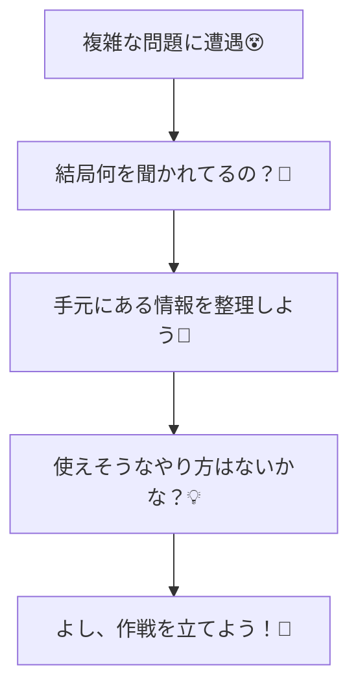
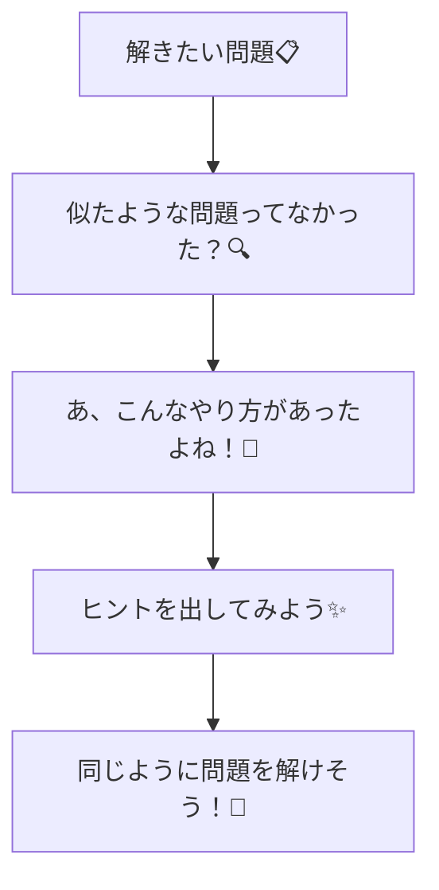
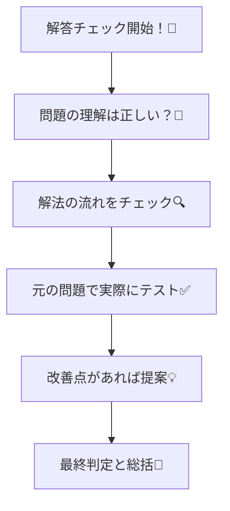

## はじめに
プロンプトには色々とテクニックが発表され、学術・実務の方面から、様々な知見が日々発信されています。
今回はその中で、以下のツイートで紹介されていた論文を読んだので、その読書感想文です。
https://x.com/1amageek/status/1935140337959452935
正確なことは、ツイート内で紹介されている論文を読んでほしいですが、主観ありありでも良ければこの記事を読んでいただけますと幸いです。
## 論文の前提
論文の個人的本旨に行く前に、この論文の立ち位置について記載します。
まず、この論文は認知科学の知見に基づくプロンプトによって、LLMの性能を引き出すことを目的としています。
そして、その引き出し方は追加学習による推論機能の向上というよりは、元々持っているモデルの性能を引き出すことを目的としています。(私の解釈が入っているので正確な表現ではないかもしれません）
なぜ上記の形にしているかというと、論文では以下の記載があります。
> Recently, a critical reanalysis of the role of RL in eliciting reasoning in LLMs has added a new
intriguing chapter to this story by pushing the narrative that the inherent capabilities of base models
might be as important as RL (if not more) in enabling reasoning
> 

推論能力の向上は、元々LLMが持っている能力を引きだすことが、強化学習によるものと同程度かそれ以上に寄与すると記載しています。
この立場から、よりLLMが本来持っている推論能力を引き出す手法について、展開されています。
色々な意見はあるかと思いますが、この論文での立ち位置を把握しておくとこの後の流れがなじみやすいかも？しれないです。
## 論文の個人的本旨
この論文の言いたいことは主に以下の二つに集約されるかなと思います
- 推論を引き出す4つのプロンプト手法を使用する
- そして、プロンプトは役割毎にそれぞれ独立して実行する

まずは、4つのプロンプトについて論文内での記載を確認します。
### 推論を引き出す4つのプロンプト手法を使用する
**understand question**
人間の推論を模倣させ、まず問題の把握に努めさせるプロンプトです。
個人的には解く前にちゃんと、問題の詳細を把握させるプロンプトと理解しました。
流れとしては以下のような形で推論できるようなプロンプトを実行させます。

**recall related**
解決したい問題に似た問題と、その回答を与えます。
類似問題とその回答を与えることで、対象の問題をより適切な形で回答させる手助けになります。
数学の教科書とかで、類題を先に解いて方向性を掴んでから、本番の問題を解く流れをプロンプト手法として落とし込んだと理解しています。
流れは以下の形で推論できるプロンプトかと思っています。

**examine answer**
LLMの推論プロセス全体を振り返りを実行させます。
振り返りによって、論理的欠陥・計算ミス・見落とした制約などを発見させることで、推論の質を向上させるようにします。
実際に修正までは作業として渡さず、あくまで回答に問題ないかをチェックさせるまで行ってもらいます。
修正までさせると、他の作業が入ることになるのであくまで回答が問題ないかをチェックさせるまでを想定していそうです。

**backtracking**
LLMが出力した値などが誤っていた場合、 問題を考察し、行った推論を考察・要約をさせます。
これによって、推論を正しい方向に修正させることで正確な問題解決につながるようです。
なお、このプロンプトは必ず実行するというよりは、行った推論が誤りの場合に実行させます。
以上が論文内で紹介されていたプロンプトの種類になります。
各プロンプトを個別に実行させたときの、回答率は以下の通りです。

各プロンプト単体でも性能が向上しているのを確認できますね。
### プロンプトは役割毎にそれぞれ独立して実行
それぞれのプロンプトについて見ていきました。
認知科学の手法を取り入れたプロンプトがいい感じに推論能力を引き上げることができるのは面白いですね。
ただ、[認知科学の手法を用いる、推論能力が向上する研究](https://arxiv.org/abs/2410.02953)はすでにあったみたいです。
なので、この論文がLLMに認知科学の手法を用いた最初の研究についてのものではなさそうです。
この論文の新規性は、認知科学の手法をそれぞれ独立して実行することで、より推論能力が向上したことが挙げられます。
論文では独立して実行する一連の手法をcognitive toolsとして表現していました。
このcognitive toolsを使って数学の問題を解かせた結果が以下のグラフです。
 より引用](/images/upgrade-llm-tracing-by-cognitive/2025-07-02_11h56_51.png)
[Eliciting Reasoning in Language Models with Cognitive Tools](https://arxiv.org/pdf/2506.12115) より引用
全てのモデルで正答率が向上していることが確認できます。
上記グラフを表にしたのが以下の通りです。

以上のようにプロンプトをそれぞれ独立して実行させ、プロンプトの内容が他のプロンプトに干渉しないことで推論能力が向上するみたいです。
以上、プロンプトのツールとそれらを独立して実行させるということがこの論文の肝かなと個人的には思っています。
それでは最後にこの論文を読んだ個人的な感想をみていきます。
## 論文に対しての感想
論文の結果はとても興味深いなと思いました。
特にプロンプトを独立して実行すると、どのモデルであっても推論能力が向上するというのは汎用性があります。
論文の中では、GPT 4.1がo1-previewに並ぶ程の推論能力をできたとも言っています。

そのため、モデル自体をコストの関係でグレードアップできない時の対応など、様々な場面で活かせる価値の高い論文だと感じました。
一方で、この論文を検証するための再現実験に関する記載は少ない気がします。
Appendixでそれらしい記載はあるのですが、詳細については書かれていないです。
例えば、Appendix Bでは実験の流れのようなことは記載されていますが、論文内で紹介されたrecall relatedプロンプトは使っていません。
また、understand questionプロンプトも使っているのですが、その結果を問題解決を行う処理に渡していなさそうでした。
このように、各プロンプトをどういった形で実行させ、その結果の連携方法について論文に記載がありませんでした。
内容自体はとても価値が高いのですが、論文の内容を正確に再現するためには読んでいる人の理解力に左右される印象です。
私はこの辺の知見があまりないので、実際にどうすれば活かせるのかがあまり分かっていないです。
以上のように、せっかく面白いのに再現手順がよくわからず、正確に論文の内容を活かせないというもどかしさを感じています。
この辺はいい感じのやり方があれば、読み込もうと思います。
皆さんはこの論文を読んでどういう感想を持ちましたか？
良ければコメントください。