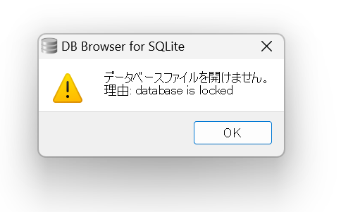

# OpenID ConnectでのOpenID ProviderをHonoとNext.jsで作成する ②DBの準備やデプロイ編

## はじめに

「**OpenID ConnectでのOpenID ProviderをHonoとNext.jsで作成する ①アプリケーションの準備編」の続きです。**

前回でプロジェクトは作成したので、今回はDBであったりCloudflare Workersなどへのデプロイをしていきます。

## ローカル環境でデータベース(Cloudflare D1)の準備

### とりあえずローカルでCloudflare D1を構築してみる

まずは、ローカル環境にCloudflare D1を構築しています。

といっても、Cloudflare D1を使うのはHonoであり、Honoは前回の記事でCloudflare Workersで実行する前提で作成しています。

なので、Cloudflare周りの設定を行うために使われる[wrangler](https://developers.cloudflare.com/workers/wrangler/)の大まかな設定はすでに完了しています。

そして、ローカルで構築するための方法はすでに様々な方が記事にしていただいています。

以下はその一例です。

https://zenn.dev/slowhand/articles/c043f67f60731d#%E5%AE%8C%E5%85%A8%E3%83%AD%E3%83%BC%E3%82%AB%E3%83%AB%E3%81%A0%E3%81%91%E3%81%AE-d1-%E7%92%B0%E5%A2%83%E6%A7%8B%E7%AF%89

例えば上記の記事に沿って行うと、以下のようなディレクトリ構造が作成されます。


その他色々と方法はありますが、少なくとも画像のようなディレクトリ構造になっていればDBの作成やデータの登録は行われています。

DB Browser for SQLliteで確認すると以下のようにテーブルができていることが確認できます。


もちろんデータも作成されています。


ちなみに、WSL上で開発している場合、SQLliteのファイルを読み込もうとしても、「database is locked」とエラーが出て開くことができません。



[こちらの記事](https://alis.to/yuuki/articles/KBXd9JVZEOn9)に同じ状況の方がおり、その方はファイルはWSLからWindowsホスト上に移動したら動いたとのことです。

私の方でも、出来上がった3つのファイルをcpコマンドでWindowsホスト側にコピーして、そちらを開くようにしたら表示されました。

このようにWranglerを使い、ローカルにDBを構築することができます。

### Prismaとの新和性を考えたDBの構築

先ほどでCloudflare D1を想定したデータベースは構築できました。

ただ、アプリ開発を行う時は、DBをそのまま操作することはあまりないかと思います。

ORMなどを間に挟むことが多いと思います。

今回の実装でもORMを使用しており、具体的にはPrismaを使用しています。

なので、ここではPrismaを使用してCloudflare D1を構築する方法をみていきます。

大きく作業としては以下の二つがあります。

1. schem.prismaの変更を表現したマイグレーションファイルを作成する
2. 作成したマイグレーションファイルをCloudflare D1に適用する

まず、schema.prismaと定義を合わせておくために、Prismaでの変更がDBの変更と同期できる必要があります。

とはいえ、その方法は[ドキュメント](https://www.prisma.io/docs/orm/overview/databases/cloudflare-d1)通りにやればできますので、ここでは特に解説しません。

一応、以下のスクリプトをpackage.jsonに登録しており、schema.prismaを変更した時の反映をサクッとしやすいようにはしています。

```json
"prisma:migrate": "prisma migrate diff  --from-local-d1 --to-schema-datamodel ./prisma/schema.prisma --script --output ",
```

上記の流れをschema.prismaが変更の度に行うと、プロジェクト直下のmigrationsファイルに以下のようのsqlファイルが作成されていきます。


なお、先頭についている「000x」は自動で付与しているのではなく、自分で都度記載しているのでご注意ください。

ここまででschema.prismaの定義とCloudflare D1の定義を同期するためのマイグレーションファイルが作れたので、後は以下のコマンドを実行して実際にCloudflare D1側に反映させます。

`wrangler d1 migrations apply wrangler.tomlもしくはwrangler.json(c)で記載しているdatabase_name --local`

以上でschema.prismaの定義とCloudflare D1の定義を合わせつつ、ローカルでCloudflare D1の構築が完了します。

なお、wranglerのマイグレーションコマンドはデフォルトでプロジェクト直下のmigrationsディレクトリ配下にファイルを作成したり、参照したりします。

もし、参照したいディレクトリを変えたい場合は[ドキュメント](https://developers.cloudflare.com/d1/reference/migrations/#wrangler-customizations)にあるように、wranglerの設定ファイルに以下のような記載をすると良いみたいです。(例はtomlファイルの場合です。)

```json
[[ d1_databases ]]
# 略
migrations_dir = "<FOLDER_NAME>" # Specify your custom migration directory
```

もしかするとmigrationsディレクトリは都合が悪い方がいるかもしれないと思い共有しました。

### (余談)シーダーについて

Prismaを使用していると、Prisma提供の[ドキュメント](https://www.prisma.io/docs/orm/prisma-migrate/workflows/seeding)のような形でシーダーを作成しているかと思います。

[ドキュメント](https://www.prisma.io/docs/orm/prisma-migrate/workflows/seeding)のようにすると、テーブルの補完などが効くのでとてもやりやすいです。

なので、Cloudflare D1でも同様にシードできるようにしたいのですが、実はCloudflare D1の場合はできません。

一応、PrismaはCloudflare D1の操作をできるようになっていますが、まだプレビュー機能なためシーダーに関しては公式にサポートされていないです。

そのため、代替方法が色々と考えられていますが、基本的にはどこかのタイミングでSQLを直接書く必要があります。

なので、今回の実装では例えば以下のようなSQLファイルを作成し、`wrangler d1 execute  wrangler.tomlもしくはwrangler.json(c)で記載しているdatabase_name --local --file=シーダー用のSQLファイル名.sql` を実行することで、データを作成しています。

```sql
INSERT INTO User (id, name, email, password)
VALUES 
  ('userId1', 'John Doe', 'john.doe@example.com','password');
```

このやり方は補完などがなく、ちょっと面倒なのでPrismaがシーダー含めてCloudflare D1関連の機能を拡充してくれることを期待しています。

### PrismaClientでCloudflare D1のデータへアクセスする

ここまでデータベースの準備から、データの投入まではできているので後は実際にアプリケーションでDB操作を行います。

といっても正直やること[ドキュメント](https://developers.cloudflare.com/d1/tutorials/d1-and-prisma-orm/)に書いてある通りのことを行うだけです。

その中でも[2. Initialize Prisma ORM](https://developers.cloudflare.com/d1/tutorials/d1-and-prisma-orm/#2-initialize-prisma-orm)と[5. Query your database from the Worker](https://developers.cloudflare.com/d1/tutorials/d1-and-prisma-orm/#5-query-your-database-from-the-worker)を実行するだけで良いです。

ただ、5についてはHono用になっていないので、そこだけ別途この記事で最小コードを示します。

```tsx
import { OpenAPIHono } from '@hono/zod-openapi'
import { PrismaD1 } from '@prisma/adapter-d1'
import { PrismaClient } from '@prisma/client'

type Bindings = {
  MY_DB: D1Database
}
const app = new OpenAPIHono<{ Bindings: Bindings }>()

app.get('/', async (c) => {
  const DB = c.env.MY_DB
  const adapter = new PrismaD1(DB)
  const prisma = new PrismaClient({ adapter })
  const users = await prisma.user.findMany()
  return c.json(users)
})

export default app
```

ポイントはBindingsです。

ここでは、wranglerの設定した値をHonoをインスタンス化する時のクラス内に紐づけることができます。

詳しいことは[ドキュメント](https://hono.dev/docs/getting-started/cloudflare-workers#bindings)を参照して欲しいですが、単純な文字列だけでなくCloudflare系のサービスであれば、wrangler.tomlもしくはwrangler.json(c)内で設定したものも紐づけることができます。

先ほど示したサンプルではCloudflare D1のデータベースを紐づけており、その場合の設定ファイルは以下のようになります。

```tsx
{
  "$schema": "node_modules/wrangler/config-schema.json",
  "name": "test-workers",
  "main": "src/index.ts",
  "compatibility_date": "2025-03-20",
  "d1_databases": [
    {
      "binding": "MY_DB",
      "database_name": "my-database",
      "database_id": "hoge"
    }
  ]
}

```

d1_databasesの中にあるbindingをアプリケーション側のBindingタイプのプロパティに設定します。

そして、今はCloudflare D1について見ているので、型についてはD1Databaseとなります。

Honoのプロジェクトを作成する時に、Cloudflare Workersで設定していればD1Databaseの型はすでにインストールされているので、インポートは不要です。

以上のようにすれば、もし一致するデータベースが存在する場合、Honoの中にデータベースの情報が格納され、データベース操作をすることができます。

実際に、アプリケーションを動かしてみてブラウザでアクセスすると以下のようにデータを取得することが確認できます。


なお、Honoに紐づける際に使用するBindingsタイプのプロパティ名は必ずwranglerの設定ファイルのbindingと名前が一致する必要があります。

例えばwranglerの設定ファイルはそのままに、Hono内のコードを以下のように変更します。

```tsx
import { OpenAPIHono } from '@hono/zod-openapi'
import { PrismaD1 } from '@prisma/adapter-d1'
import { PrismaClient } from '@prisma/client'

type Bindings = {
  /** MY_DBをDBに命名変更 */
  DB: D1Database
}
const app = new OpenAPIHono<{ Bindings: Bindings }>()

app.get('/', async (c) => {
  const DB = c.env.DB
  const adapter = new PrismaD1(DB)
  const prisma = new PrismaClient({ adapter })
  const users = await prisma.user.findMany()
  return c.json(users)
})

export default app

```

そして、同様にアプリを起動してブラウザにアクセスするとターミナルが以下のようにエラーとなります。


このようにwranglerのbinding名とHono側でBindingタイプのプロパティ名は一致していないと、Cloudflareのサービスが取得できずエラーとなるので注意です。

これでローカル環境におけるデータベースの設定が一通りできました。

では次に、Cloudfalre で実際にデータベースを作成し、それを使用します。

## Cloudflare にCloudflare D1を作成し、それを使用する

ここから実際にCloudflareにデータベースを作成し、それをアプリケーションで使用するようにします。

といっても、必要な情報は相変わらず[ドキュメント](https://developers.cloudflare.com/d1/get-started/)に書いてあります。

とはいえ、HonoやPrismaを前提にしていないため、今回においては余分な記載もあります。

そのため、かいつまんだものをこの記事の中で記載します。

なお、前提としてCloudflareへのアカウント登録はすでに完了しており、Cloudflareにはログインしている前提で記載しておりますので、ご留意ください。

### データベースの作成

まずは`npx wrangler d1 create my-database`を実行します。

my-databaseは任意のデータベース名なので、アプリによって名前を変更してください。


すると、上記のような出力がターミナル上で出てきて、同意画面へリダイレクトされます。


これをAllowボタンで許可すると以下のような値がターミナル上に出力されます。

```tsx
{
  "d1_databases": [
    {
      "binding": "DB",
      "database_name": "my-database",
      "database_id": "9c3bc86c-54fb-4b66-9c0c-853bd6c61de1"
    }
  ]
}
```

この値をwranglerの設定ファイルへコピペします。

```tsx
{
  "$schema": "node_modules/wrangler/config-schema.json",
  "name": "test-workers",
  "main": "src/index.ts",
  "compatibility_date": "2025-03-20",
  "d1_databases": [
    {
      "binding": "DB",
      "database_name": "my-database",
      "database_id": "9c3bc86c-54fb-4b66-9c0c-853bd6c61de1"
    }
  ]
}

```

そして、Cloudflareのサービス上にもデータベースができているのが確認できます。


これで設定は完了です。簡単ですね。

とはいえ、まだデータベースにテーブルやデータが存在しないので設定が必要です。

設定は必要なのですが、この後行うことはこれまでやってきた以下二つのコマンドを少し変えて実行するだけです。

`wrangler d1 migrations apply wrangler.tomlもしくはwrangler.json(c)で記載しているdatabase_name --local`

`wrangler d1 execute  wrangler.tomlもしくはwrangler.json(c)で記載しているdatabase_name --local --file=シーダー用のSQLファイル名.sql`

これらはマイグレーションファイルをローカルのCloudflare D1に適用させ、シーダーでデータを投入している作業でしたね。

上記を以下のように変更し、実行します。

`wrangler d1 migrations apply my-database --remote`

`wrangler d1 execute  my-database --remote --file=seed.sql`

最も注目して欲しいのは、localがremoteに変わっただけということです。

これによって、wranglerの設定ファイルと一致するデータベースにマイグレーションであったり、シーダーを実行します。(CIで実行する時は、別途アカウントIDとAPIトークンが必要です)

実際に上記二つを流してみます。

すると、Cloudflare上で以下のようにUserテーブルとその中にデータができているのを確認できます。


`npx wrangler d1 execute tutorial --remote --command="SELECT * FROM Users”`でローカルから実行しても、以下のデータが表示されます。


ローカルのアプリケーションからはアクセスできなかったので、アクセスするにはCloudflare Workersへのデプロイが必要になりそうです。

そのため、次はHonoをCloudflare Workersにデプロイしていきます。

## HonoをCloudflare Workersへデプロイ

HonoをCloudflare Workersへデプロイし、DB情報の取得を確認していきます。

とはいえ、ここまで設定が終わっていたら、デプロイするだけの場合めちゃくちゃ簡単です。

`npm run deploy`を実行すれば、以下のようにデプロイされます。


ターミナル上で出力されたドメインにアクセスすると、データベースの値が取得できているかと思います。

デプロイ自体以上で終わりです。

とても簡単ですね。

これらのことから、手動であればデータベースの更新やデプロイはとても簡単です。

とはいえ、一人だけの開発なら良いですが、複数人が開発している場合手動でデプロイするのは適切ではありません。

また、データベースの更新なども手動だと忘れてしまいます。

なので、自動化していこうと思います。

## GitHub Actionsでデータベースのマイグレーションとアプリのデプロイをする

ここからは、これまでやって来たことをCI上で行うようにします。

流れとしては、

1. mainブランチにプッシュされたタイミング
2. データベースのマイグレーションを実行
3. アプリケーションをデプロイする

でやっていきます。

なお、GitHub Actionsの構文の詳細は触れませんので、雰囲気で感じとってください。

### コード全体像

まずは、GitHub Actionsのコード全体を記載します。

```yaml
name: Deploy to Cloudflare Workers

on:
  push:
    branches:
      - main
defaults:
  run:
    shell: bash

jobs:
  migrateDb:
    runs-on: ubuntu-latest
    timeout-minutes: 60
    steps:
      - uses: actions/checkout@v4
      - uses: actions/setup-node@v4
        with:
          node-version: "20"
      - run: |
          npm install -g wrangler
          wrangler d1 migrations apply ${DATABASE_NAME} --remote
        env:
          CLOUDFLARE_API_TOKEN: ${{ secrets.CLOUDFLARE_MIGRATION_D1_API_TOKEN }}
          CLOUDFLARE_ACCOUNT_ID: ${{ secrets.CLOUDFLARE_ACCOUNT_ID }}
          DATABASE_NAME: ${{ secrets.CLOUDFLARE_DATABASE_NAME }}

  deploy:
    runs-on: ubuntu-latest
    timeout-minutes: 60
    needs: migrateDb
    steps:
      - uses: actions/checkout@v4
      - name: Build & Deploy Worker
        uses: cloudflare/wrangler-action@v3
        env:
          API_TOKEN: ${{ secrets.CLOUDFLARE_API_TOKEN }}
          ACCOUNT_ID: ${{ secrets.CLOUDFLARE_ACCOUNT_ID }}
        with:
          apiToken: ${{ env.API_TOKEN }}
          accountId: ${{ env.ACCOUNT_ID }}
```

かいつまんでみていきます。

### Actionの実行タイミング

```yaml
on:
  push:
    branches:
      - main
```

上記コードで、mainブランチへのプッシュがあった時に実行するようになります。

### データベースのマイグレーション

```yaml
  migrateDb:
    runs-on: ubuntu-latest
    timeout-minutes: 60
    steps:
      - uses: actions/checkout@v4
      - uses: actions/setup-node@v4
        with:
          node-version: "20"
      - run: |
          npm install -g wrangler
          wrangler d1 migrations apply ${DATABASE_NAME} --remote
        env:
          CLOUDFLARE_API_TOKEN: ${{ secrets.CLOUDFLARE_MIGRATION_D1_API_TOKEN }}
          CLOUDFLARE_ACCOUNT_ID: ${{ secrets.CLOUDFLARE_ACCOUNT_ID }}
          DATABASE_NAME: ${{ secrets.CLOUDFLARE_DATABASE_NAME }}
```

ここでは、Cloudflare D1へマイグレーションを行っています。

基本的に、migrationsディレクトリ中にあるマイグレーションファイルを実行します。

先程は言っていなかったのですが、wranglerのマイグレーションはCloudflare D1に適用されていないマイグレーションファイルのみを実行します。

なので、特にマイグレーションすることが無ければスキップされます。

便利ですね。

usesについては、他の人が作ったGitHub Actionsを使うための設定です。

今回は、マイグレーションファイルが欲しいのでactions/checkoutでコードを取得し、wranglerを実行するためにactions/setup-nodeでNodeを使用できるようにしています。

actions/checkoutの詳しい挙動については、[こちらの記事](https://qiita.com/shun198/items/14cdba2d8e58ab96cf95#actionscheckoutv4%E3%81%A3%E3%81%A6%E4%BD%95%E3%81%97%E3%81%A6%E3%82%8B%E3%81%AE)で検証された方がいますので、参照ください。

後は、wranglerにてデータベースのマイグレーションを行っています。

なお、ローカルではCloudflareへのログインができていたので、wranglerコマンドを実行すればマイグレーションができていました。

しかし、CI上ではCloudflareへのログインができないので、wranglerのコマンドを実行するには別途Cloudflare のアカウントIDとAPIトークンが必要になります。

これらの取得方法などは、[こちらの記事](https://zenn.dev/monicle/articles/4613eb4064dc40#3.-cloudflare-api-%E3%83%88%E3%83%BC%E3%82%AF%E3%83%B3%E3%82%92%E4%BD%9C%E6%88%90)そのままなのでここでは割愛します。

権限については、以下の設定で行いました。


これが適切かは判断つきかねますが、少なくとも上記権限であればマイグレーションを実行できます。

### Cloudflare Workersへデプロイ

```yaml
  deploy:
    runs-on: ubuntu-latest
    timeout-minutes: 60
    needs: migrateDb
    steps:
      - uses: actions/checkout@v4
      - name: Build & Deploy Worker
        uses: cloudflare/wrangler-action@v3
        env:
          API_TOKEN: ${{ secrets.CLOUDFLARE_API_TOKEN }}
          ACCOUNT_ID: ${{ secrets.CLOUDFLARE_ACCOUNT_ID }}
        with:
          apiToken: ${{ env.API_TOKEN }}
          accountId: ${{ env.ACCOUNT_ID }}
```

最後はCloudflare Workersへのデプロイです。

といっても、[ドキュメント](https://developers.cloudflare.com/workers/ci-cd/external-cicd/github-actions/)の内容をほぼそのまま拝借しただけです。

敢えて違いを言うなら、needsプロパティを追加し、データベースのマイグレーション処理が終わった後に実行するようにしました。

それ以外は、ほぼドキュメントと一緒です。

権限については、Cloudflareが用意しているテンプレートを使用しました。


以上全てを完了し、GitHubのmainブランチにプッシュすると、手動で行ったのと同様にCloudflare Workersへのデプロイとデータベースへのアクセスができるかと思います。

## Next.jsをVercelへデプロイ

ここまでCloudflare D1の設定や、HonoをCloudflare Workersへデプロイする手順をみていきました。

なので、次はNext.jsをVercelへデプロイしていきます。

といっても、すみません以下の記事とやり方はほぼ全く一緒なので割愛します。

https://qiita.com/go-shun/items/b3eb1a0b766915ae3e5c#github%E3%81%B8%E3%83%97%E3%83%83%E3%82%B7%E3%83%A5

https://zenn.dev/hayato94087/articles/b30efe589baa0e#github%E3%81%AE%E3%83%AA%E3%83%9D%E3%82%B8%E3%83%88%E3%83%AA%E3%82%92%E4%BD%9C%E6%88%90

## おわりに

今回はデータベース回りの準備や、Cloudflare Workersの準備を行っていきました。

中々アプリケーションの開発に入れませんね。

とはいえ、大まかなアプリケーション開発の準備はできたので、ここから中身を埋めていきます。